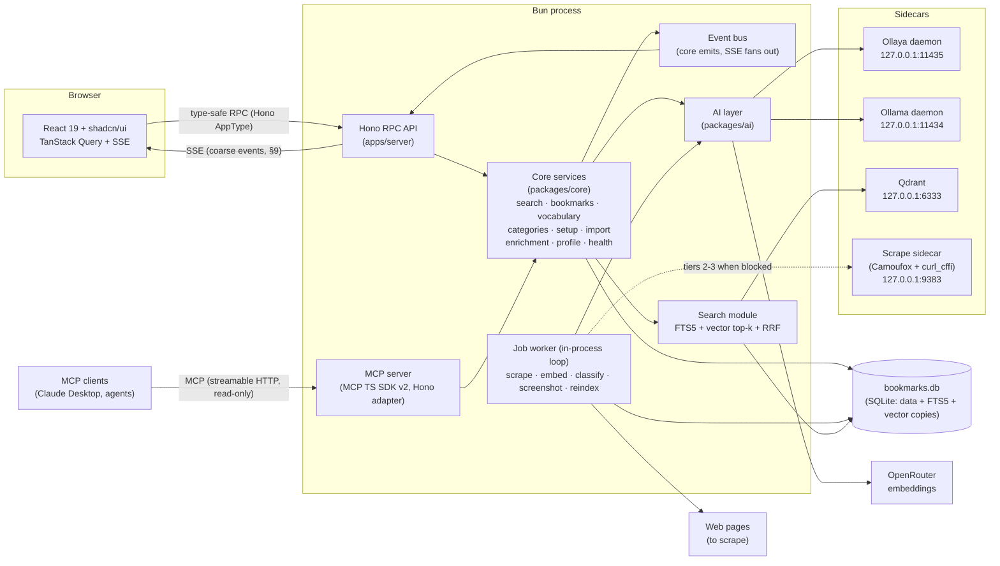
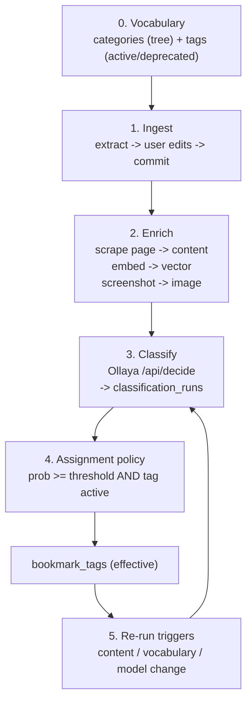

# al-yo-bo — Architecture

> v2, rewritten 2026-10-04 for the full rewrite (see `docs/plans/rewrite-v2.md`). Reference
> document. It describes the intended shape of the system, the cross-cutting decisions, and the
> subsystems that are not obvious from the code. It is written to be safe for humans and agents to
> rely on: decisions are stated explicitly and each one has a rationale.
>
> Related docs: [README](../README.md) (human overview), [MODEL.md](./MODEL.md) (data model),
> [DESIGN.md](./DESIGN.md) (UI system), [AGENTS.md](../AGENTS.md) (agent instructions),
> [rewrite-research.md](./plans/rewrite-research.md) (superseded research record),
> [rewrite-v2.md](./plans/rewrite-v2.md) (the approved rewrite plan).

## 1. Principles & constraints

These constrain every later decision. A change that violates one needs an explicit note here first.

1. **Bun-native.** Prefer Bun's built-in APIs and ecosystem. Node only when a dependency forces it.
2. **One durable store.** Relational data, full-text search, and the durable copy of the vector
   data live in one SQLite file. Nothing else ever holds the only copy of durable data. Rebuildable
   *serving* structures may live outside the file (FTS5 inside it; a local Qdrant collection
   outside it): losing one is repaired from SQLite without re-embedding (§6).
3. **Self-hosted, local components only.** A single-user tool. It must never require a hosted
   or cloud service. Optional sidecars must be self-contained local components — single binaries
   (Ollaya, Qdrant) or one pinned uv-managed service (the scrape sidecar, §10) — and every
   feature must degrade gracefully when a sidecar is down. The single user has a profile (a person
   — MODEL.md principle 8); it is not an account system.
4. **Docs-first.** Architecture, data model, and design are decided in `docs/` before code. Prefer
   well-documented, open-source components over bespoke infrastructure.
5. **Classifier is optional.** Search, tagging, and browsing must all work with the classifier
   offline or absent. Classification enriches; it never gates core features.
6. **Real-time is coarse and lossy by design.** Live updates travel as coarse domain events
   (§9) whose only job is to trigger refetches. An event is a hint, never a payload of record;
   a client that misses one still converges on the next event, refocus, or refetch. Events
   originate exclusively in `packages/core` services.

## 2. Technology stack

The stack is chosen to satisfy §1. Changing a row here means updating the subsystem section that
depends on it.

| Layer           | Choice                               | Notes                                                                                    | URL                                                                                                  |
| --------------- | ------------------------------------ | ---------------------------------------------------------------------------------------- | ---------------------------------------------------------------------------------------------------- |
| Runtime         | **Bun**                              | Node only if a dependency forces it                                                      | [bun.com](https://bun.com)                                                                           |
| Web framework   | **Hono**                             | server routes; hosts the MCP server (§8)                                                 | [hono.dev](https://hono.dev)                                                                         |
| Reactive client | **React 19 + Hono RPC**              | UI; bundled with **Vite**                                                                | [react.dev](https://react.dev), [hono.dev/docs/guides/rpc](https://hono.dev/docs/guides/rpc)         |
| UI components   | **shadcn/ui**                        |                                                                                          | [ui.shadcn.com](https://ui.shadcn.com)                                                               |
| Chat UI         | **AI SDK `useChat` + beui primitives** | React hook runtime over the UI message stream; vendored `agents/` kit in `apps/web`    | [ai-sdk.com](https://ai-sdk.com)                                                                     |
| AI layer        | **AI SDK v7 via `packages/ai`**      | one typed config + provider registry; embeddings, extraction, chat, agents; MCP *client* | [ai-sdk.com](https://ai-sdk.com)                                                                     |
| MCP server      | **MCP TS SDK v2 + `@modelcontextprotocol/hono`** | bookmarks MCP server mounted in the Hono app (§8)                            | [modelcontextprotocol.io](https://modelcontextprotocol.io)                                           |
| Classifier      | **Ollaya**                           | open decision models, single binary, sidecar daemon (young, pre-1.0); bespoke `ClassifierClient` in `packages/ai` — it is a decision server, not an LLM gateway | [ollaya.dev](https://ollaya.dev) · [github](https://github.com/ollaya-dev/ollaya) |
| LLM access      | **AI SDK v7**                        | `generateText` + `Output.object`; Ollama locally, OpenRouter in production               | [ai-sdk.com](https://ai-sdk.com)                                                                     |
| Extraction      | **`@ai-sdk/openai-compatible`** + **`ollama-ai-provider-v2`** | LLM import extraction (OpenRouter primary, Ollama local); deterministic parser fallback | [ai-sdk.dev/providers](https://ai-sdk.dev/providers/openai-compatible)       |
| Screenshots     | **`Bun.WebView`** (experimental)     | zero-install WebKit capture (Chrome over CDP on Linux/Windows); `og:image` fallback       | [bun.com/docs/api/webview](https://bun.com/docs/api/webview)                                         |
| Scraping        | **Camoufox + curl_cffi** (sidecar)   | tiered scrape ladder: plain fetch → TLS-impersonated fetch → headless stealth-Firefox render; uv-managed local service (§10) | [github.com/daijro/camoufox](https://github.com/daijro/camoufox)                                     |
| Embeddings      | **OpenRouter (via `packages/ai`)** + **SQLite BLOBs** | durable vector copy in the DB file; query text embedded at request time  | [openrouter.com](https://openrouter.com)                                                             |
| Vector serving  | **Qdrant** (single binary, sidecar)  | filtered top-k; in-process KNN is the offline fallback                                   | [qdrant.tech](https://qdrant.tech/documentation/)                                                    |
| Search          | **SQLite FTS5** + **RRF fusion**     | keyword (FTS5) + semantic (Qdrant/KNN), fused app-side                                   | [sqlite.org](https://sqlite.org)                                                                     |
| Background jobs | **In-process job loop** (Bun)         | sequential, idempotent jobs with bounded retries (§10)                                    |                                                                                                      |
| Live updates    | **In-process event bus → `streamSSE`** | core emits coarse events; web invalidates TanStack Query caches (§9)                    |                                                                                                      |
| Configuration   | **env**                              | parsed once by `packages/ai` config (§8)                                                 | [bun.com/docs/runtime/environment-variables](https://bun.com/docs/runtime/environment-variables)     |
| Deployment      | **shell scripts**                    | a `nohup bun run server.ts` on the server, shell script to copy and unpack a dist archive |                                                                                                      |

**Web build (decided).** `apps/web` is a Vite + React 19 SPA. Vite is used for local dev and the
production build (`apps/web/dist`) because shadcn/ui's CLI targets Vite and Bun's fullstack bundler
does not yet apply plugins (Tailwind included) in its production CLI build. This does not weaken
the Bun-native constraint: Bun stays the runtime, package manager, test runner, and server, and in
production the same Bun process serves the built assets through Hono (`serveStatic`), so §11 still
describes a single process. The trigger to revisit this is in §13.

**Chat (decided).** `POST /api/chat` streams an AI SDK UI message stream from the local Ollama
daemon (`streamText` + one `searchBookmarks` tool that runs the same hybrid search path as the API
via `SearchService.chatHits` — compact hits only, never page content). The route is mounted outside
the typed RPC surface (streams are not JSON) and answers 503 problem+json when `OLLAMA_CHAT_MODEL`
is unset; like every optional sidecar (§1.5) an unreachable daemon only degrades chat, surfacing an
error part in the stream while the rest of the app is unaffected. The web side is `@ai-sdk/react`
`useChat` with a `DefaultChatTransport` pointed at `/api/chat`, rendering tool activity, markdown,
and citations with the vendored beui primitives (DESIGN.md §Chat).

## 3. System overview

The app is one Bun process that serves the API, the MCP server, hosts the worker, and talks to a
small number of external participants. Everything durable is in the SQLite file.



**Processes.** The API, MCP server, event bus, and job worker run inside the same Bun process in
the default single-user deployment (the worker is an in-process loop, §10); nothing in the job code
assumes co-location, so extraction into a separate entry point stays possible. The worker is a
durability boundary (§10), so it is shown separately.

**Transport vs. domain.** `apps/server` (the Hono API) is a thin transport adapter: it parses HTTP,
calls exactly one `packages/core` service, and maps domain errors to problem+json. `packages/core`
owns the application services — search orchestration, bookmark CRUD and its re-run triggers,
vocabulary, categories (tree), setup, import, the enrichment queue, the single-user profile, and
health. The app edge constructs the concrete adapters (AI layer, Qdrant stack, scraper, avatar file
store) and injects them as interfaces, so core stays transport-neutral and testable without a
server.

**External participants.**

- **Ollaya** — the classifier decision daemon, an independent single binary. Runs next to the Bun
  server as a sidecar (§7, §11). Never a Node dependency. It is a **decision server** (typed
  `choice`/`score`/`noul` questions → calibrated probabilities; it never generates text and has no
  OpenAI-compatible endpoints), so it can never be an AI SDK provider — it stays behind its
  bespoke `ClassifierClient` boundary, centrally configured (§8). It already ships its own MCP
  server: it is something we *expose to* agents, not wrap.
- **Ollama** — the local LLM daemon serving the chat model (`OLLAMA_CHAT_MODEL`) over its
  OpenAI-compatible endpoint; also the local fallback for import extraction (§7). Optional like
  every sidecar (§1.5): unset model → chat answers 503; unreachable daemon → an in-stream error. Do
  not confuse it with **Ollaya** (the classifier daemon above).
- **Qdrant** — the vector-serving sidecar, a single local binary (§6). Holds only a rebuildable
  serving copy of the embeddings; SQLite is canonical.
- **Scrape sidecar** — an optional uv-managed Python service (§10): a `curl_cffi` TLS-impersonation
  fetch tier and a headless **Camoufox** render tier for the scrape ladder. Chosen over the
  evaluated alternatives (§10, "Scraping alternatives"); with the sidecar down or absent, scraping
  is plain fetch exactly as before (§1.5).
- **OpenRouter** — embedding + LLM provider via `packages/ai` (document vectors in the worker,
  query vectors in the API, extraction models). Optional at the database level: bookmarks without
  embeddings are still findable by keyword.
- **The open web** — fetched by the scraper job only; the app never proxies page loads for the UI.

## 4. Monorepo layout

Bun workspaces. The goal is a small, acyclic package graph, not an exhaustive taxonomy.

```
apps/
  server/          Hono routes (transport adapters), RPC contract, worker entry,
                   event bus → SSE fan-out, MCP mount, bootstrapping
  web/             React 19 app (shadcn/ui, TanStack Query + SSE), talks to server via Hono RPC
packages/
  db/              schema (born at 0001), PRAGMAs, typed queries, seed
  search/          RRF fusion + in-process KNN + client-side filtering (fallback VectorIndex)
  vectordb/        Qdrant client (VectorIndex adapter, collection sync)
  ai/              one AI layer: typed config, provider registry, EmbeddingClient +
                   ClassifierClient interfaces, OpenRouter/Ollaya/Ollama adapters, health probes
  importer/        markdown collection-file parser, LLM extraction port, and ingest
  exporter/        bookmark export serializers (Netscape HTML, JSON, CSV, markdown collection)
  core/            domain/application services (search, bookmarks, categories, vocabulary, ...);
                   the only event-emission layer; no HTTP
  shared/          domain types + utilities (no framework imports)
```

**Dependency direction** (arrows = "may import"):

```
web ─▶ shared
server ─▶ core, db, search, vectordb, ai, shared
core ─▶ db, importer, exporter, search, ai, shared
db, search, vectordb, ai, importer ─▶ shared
exporter ─▶ shared
importer ─▶ db
```

Rules:

- `shared` imports nothing from the app (no Hono, no Bun-specific runtime, no database client).
  It owns the `VectorIndex` interface, the LE-Float32 BLOB codec shared by `search` and
  `vectordb`, and the browser-safe uuid codec (`uuid-codec.ts`). Id generation
  (`Bun.randomUUIDv7`) and fractional-index keys live in `packages/db` — the layer that mints row
  keys — so the web bundle can never pull a Bun API through `shared`.
- `db` owns all SQL; only `apps/server` opens/sets up the SQLite file, then hands the handle to
  `core`. `core` composes typed `db` queries into application services but writes no SQL of its
  own; the Qdrant startup sync (which passes plain records into `packages/vectordb`) stays in
  `apps/server`.
- **`packages/ai` interface/adapter split (decided).** `core` may import only the **interface**
  modules from `ai` (`EmbeddingClient`, `ClassifierClient`, `SuggestClient` and their types).
  Concrete adapters and the single construction point (`buildAiLayer(config)`, `packages/ai`'s
  index) are consumed only by `apps/server`, which injects the built layer into core. This keeps core transport-neutral and
  testable with fakes, while the concrete provider wiring stays at the edge.
- `search`, `vectordb`, and `ai`'s adapters take and return plain data, so they are testable
  without a running server.
- `exporter` holds the pure export serializers — string in, string out, no I/O. Its tests import
  `importer` to prove the markdown export round-trips; that dependency is test-only, keeping the
  runtime graph acyclic.
- **Event emission lives in `core` only (decided).** `db` never emits: it is a query layer with no
  knowledge of domain moments. Seed/CLI/migration writers bypass core and are therefore
  event-silent — documented, accepted, and the reason the change-log outbox upgrade path exists
  (§9).
- No cycles. `server` is the only package allowed to depend on a concrete implementation of each
  subsystem; `web` depends on `server` only through its exported route type (type-only).

**Hono RPC typing.** `apps/server` exports its route type (`export type AppType = typeof routes`);
`apps/web` imports it **as a type only** and derives a typed client. This keeps the contract in one
place and adds no build-time coupling to server code.

## 5. Data & storage

The schema, invariants, and deletion semantics are owned by [MODEL.md](./MODEL.md). Architecture
only fixes the storage posture:

- **Single durable file.** All tables, the FTS5 index, and the embedding vectors live in one SQLite
  database (constraint §1.2). Backups are a file copy. The Qdrant collection is a derived serving
  structure (§6) and never needs backing up.
- **One data root.** Every file artifact — the SQLite database, screenshots, the profile avatar,
  and the Qdrant storage tree — lives under one data root (`DATA_DIR`, default repo `./data`;
  resolved by `packages/db` `resolveDataDir` and shared by the server and the CLI scripts). One
  env knob relocates the whole tree for deployment; `DB_PATH`/`SCREENSHOTS_DIR` override the
  individual paths. **Development isolation is a scratch `DATA_DIR`** (e.g.
  `DATA_DIR=/tmp/ayo-scratch bun run dev`) — there is no profile-switching mechanism and no
  per-user subfolders (the app is single-user, §1.3; a second user, if ever requested, is a second
  instance with its own `DATA_DIR`, §13).
- **Migrations.** Numbered, forward-only SQL files under `packages/db`, applied at startup in a
  transaction. The database is **born at `0001`** in the final shape (MODEL.md v2): no datasets,
  no sections, global URL uniqueness, sibling-unique category names, unscoped tags. There is no
  legacy-data migration; the pre-rewrite model lives at the `legacy` git tag. The server-set
  timestamp triggers and the FTS sync triggers belong here.
- **PRAGMAs.** `foreign_keys = ON`, WAL journaling, and a sensible `busy_timeout` are set on every
  connection.

### Canonical verification fixture (decided)

The synthetic **octocat** demo is the single canonical seed and verification fixture:

- **Source.** Curated, vendorable real well-known URLs under the octocat profile (~25 bookmarks
  across a small category tree: e.g. `GitHub`, `AI tools`, `Dev tools`, `Learning`, `Design`), plus
  a tree-native markdown collection file (H2 → level-1 category, H3 → child) that seeds through
  the importer itself, so the seed exercises the real ingest path.
- **Use.** All integration tests (import round-trip, search sanity with expected hits, classifier
  run/evidence shape, aggregates) and Playwriter visual QA run against a scratch `DATA_DIR` seeded
  with octocat. Screenshot evidence from visual QA goes to `.omo/evidence/` (gitignored), never
  into fixtures.
- **Exclusions.** Real personal data is never a fixture (the old `leo`/`grimoire` seeds are not
  carried over). `docs/examples-mds/*` are real user collections — reserved for a much later
  import-edge-case test phase, and never treated as product requirements.

### Browser e2e suite (decided)

`bun run test:e2e` drives the real server + web app through **Playwriter** (never Playwright) in a
disposable headless Chrome (`scripts/e2e.ts` orchestrates; scenarios in `e2e/scenarios/*.mjs`):

- **Isolation.** Each run boots a scratch `DATA_DIR`, seeds octocat (which also marks setup
  complete, bypassing the first-run wizard), starts server (3000) + web (5173) dev processes, and
  tears everything down afterwards. Root `.env` and provider env vars are deliberately not
  forwarded, so the suite always exercises the degraded, sidecar-free contract (keyword-only
  search, deterministic import parser) — the same behavior ARCHITECTURE §12 guarantees.
- **Scope.** Function, not aesthetics: navigation, search/filters/pagination, bookmark CRUD,
  vocabulary management, import/export, profile persistence. Semantic/hybrid search, classifier
  tagging, and LLM chat are out of scope (they need sidecars).
- **Mechanics.** Scenarios are plain ESM executed by `playwriter -f`; results are JSONL files
  under `/tmp` keyed by scenario name (the playwriter relay daemon caches imported modules and
  only tails console output, so stdout alone is not a reliable channel — scenarios import helpers
  with a cache-busting query). Filter/selection state survives same-document hash navigation, so
  every scenario starts with a fresh document load.

## 6. Search subsystem

**Decision: SQLite FTS5 (keyword) + a Qdrant sidecar (semantic top-k), fused app-side with
Reciprocal Rank Fusion (RRF).** Vectors are durably stored as BLOBs in `bookmark_embeddings`;
Qdrant serves filtered top-k queries. An in-process brute-force KNN scan over the SQLite rows is
the automatic fallback whenever the sidecar is unreachable — it is kept warm at startup and never
a separately maintained path.

### Why a vector sidecar, and why Qdrant

The v1 plan served semantic search entirely from an in-process brute-force scan (kept below as the
fallback). Serving moved to Qdrant (decided Sep 2026) for three reasons: **server-side filtered
top-k** (category/tag filters are evaluated inside the vector query instead of after fusion), an
HNSW index with headroom past the brute-force revisit trigger, and a real ops story (snapshot API,
memory tiers). Both single-binary options were evaluated:

- **Qdrant** (chosen) — one static binary (~30 MB, macOS arm64 / Linux musl), snapshot API for
  backups, payload filtering with per-field keyword indexes inside top-k, point ids are native UUID
  strings (our bookmark UUIDv7s map directly), mmap-based memory control. REST client works under
  Bun (gRPC does not; the undici dispatcher it configures is ignored by Bun's shim — pinned
  `@qdrant/js-client-rest`, REST only).
- **Chroma** (rejected) — the fetch-only JS client is explicitly Bun-tested (a plus), but the OSS
  server has **no backup API** (consistent copy requires quiescing writers and copying the data
  directory), hybrid/RRF is Chroma-Cloud-only, the Linux binary is ~512 MB, HNSW memory cannot be
  tuned down, and unpatched advisories existed at evaluation time.

Both contradict the original "no side-car database file" reading, which is why §1.2 was reworded to
separate the **durable** store (SQLite) from **rebuildable serving** structures. Qdrant is to
semantic search exactly what FTS5 is to keyword search: derived, disposable, repaired from the
database at startup. **sqlite-vec** remains the documented fallback if a SQL-integrated index is
ever preferred over a sidecar (same trade as before: system SQLite on macOS cannot load
extensions).

The remaining v1 rejections stand: **zvec-node** (collection-per-directory, native addon without
Bun support), **ruvector** (experimental, second storage file), **Orama / LanceDB / DuckDB VSS /
Meilisearch / Typesense** (second persistence format, N-API fragility, or external server).

### At personal scale, the fallback alone is enough

A benchmark on the reference machine (Bun 1.4.2, arm64, top-k = 10) measured a pre-normalized
`Float32Array` matrix scan (cosine = dot product):

| dims | 1,000 docs | 10,000 docs | 50,000 docs | matrix @ 10k |
| ---- | ---------- | ----------- | ----------- | ------------ |
| 1536 | 1.4 ms p50 | 14.2 ms p50 | 68.9 ms p50 | 61 MB        |
| 512  | 0.5 ms p50 | 4.8 ms p50  | 22.7 ms p50 | 20 MB        |

This is why the fallback is viable: when Qdrant is down, semantic search still answers in
milliseconds at bookmark-collection scale. The Qdrant sidecar buys filtered top-k and headroom, not
raw speed at this size. The revisit conditions are in §13.

### Data layout and lifecycle

- `bookmark_embeddings` is the **durable** copy: a regular STRICT table (`bookmark_id` BLOB UUIDv7,
  PK, FK cascade, `dims`, `model`, `embedding` BLOB little-endian Float32, `updated_at`). See
  MODEL.md. Backups are the SQLite file copy.
- The Qdrant collection (default `bookmarks`) holds one point per embedding: point id = bookmark
  UUID, cosine space, payload `{ model, dims, categoryId, tagIds }` with keyword payload indexes on
  the filter fields, and collection metadata `{ model }`. Category/tag filters are pushed into the
  vector query server-side; there is no scoping axis left to filter by (MODEL.md principle 1).
  `ensureCollection` re-ensures the payload indexes idempotently.
- **All rows must share one dimension** (fixed by `EMBEDDING_MODEL`); a model change requires a
  re-embed pass. On startup the collection is checked against the SQLite rows: a dims/model
  mismatch drops and recreates it, and `sync` rebuilds the collection from SQLite with a full
  delete-all + re-upsert (not an incremental replay) — simple, bounded, and always correct; the
  boot write cost is acceptable at personal-library scale, revisit around ~50k rows. Qdrant data
  loss is therefore free to recover — never re-embed.
- **`bookmark_embeddings.model` stores the configured `EMBEDDING_MODEL`**, not the provider's
  response echo: OpenRouter normalizes model ids (e.g. `text-embedding-3-small` for
  `openai/text-embedding-3-small`), and storing the echo would flag every row as stale on every
  startup, re-embedding the whole library forever. The startup reconciliation compares rows against
  the configured model, so a genuine model change re-embeds exactly once. **This rule survives the
  `packages/ai` migration intact and carries a dedicated test** (§8).
- Write-through order: SQLite first (canonical), then the index (Qdrant point and in-memory matrix).
  Index writes are best-effort; a missed write is repaired by the next startup sync.
- `packages/search` loads all SQLite embeddings into one contiguous normalized matrix at startup
  (the fallback), and `FallbackVectorIndex` routes reads/writes to Qdrant with a 30 s failure
  cooldown before falling back. Filters apply on **every** backend path: Qdrant filters
  server-side; any non-filtering index (the in-memory `KnnIndex`, used when `QDRANT_URL=''` or
  when boot sync fails) is wrapped in `FilteringVectorIndex`, which applies the same client-side
  overfetch (8×) + filter with payloads resolved from SQLite in one query. The boot-time `sync`
  is retried for a few seconds before the fallback engages, because `bun run dev` starts the
  sidecar in parallel and it may still be binding :6333.

### Query path

1. Keyword candidate list from FTS5 (BM25 ranked).
2. Semantic candidate list: embed the query text via `packages/ai`, then filtered top-k from the
   vector index (Qdrant server-side filter, or fallback overfetch+filter).
3. RRF fusion (`k = 60`) merges the two ranked lists into the final order.

**Degradation.** Any missing link — no embedding route (no production key, no `OLLAMA_EMBED_MODEL`
in dev), empty vector set, Qdrant down — returns keyword-only results. This is a normal state, not
an error.

## 7. Classifier workflow

Classification turns raw bookmarks into curated tag assignments with **immutable evidence**.
The rules come from MODEL.md: classification never invents vocabulary; only `active` tags are
auto-assigned; every effective tag can be traced to the run that produced it.

**Participants.** Importer job · scraper/embedder jobs · Ollaya decision daemon · assignment policy
(app code) · user (manual tagging and vocabulary curation).



### Stage 0 — Vocabulary

The user curates the category tree and tags in the UI. Categories are plain organizing records with
no lifecycle; tags carry a two-state lifecycle: `active ⇄ deprecated`. Only `active` tags are
classifier candidates and can be auto-assigned; `deprecated` retires a tag without deleting its
history. The tag lifecycle is toggled through `POST /api/tags/:id/status`.

**Vocabulary establishment (decided).** Vocabulary is created in its **usable** state:

- The **setup wizard** proposes tags and categories from the developer-profile questionnaire; on
  confirmation they are created `active`, giving a fresh workspace its first vocabulary before any
  import.
- The **importer auto-creates** any missing category or tag referenced by a collection as `active`
  at commit time (`resolveVocabulary` → `createCategory`/`createTag`). There is no staging, no
  proposal, and no review gate before bookmarks land.
- The **classifier never creates vocabulary** — it only votes on existing `active` tags; a returned
  label that matches no candidate tag is logged and discarded.
- The user tidies up afterwards through the vocabulary UI (rename, re-parent, `deprecate`, delete,
  drag-reorder).
- A fresh workspace gets its vocabulary from the setup wizard or the first import.

**Candidate set (decided).** For a bookmark, candidates are **all `active` tags** — there is no
category scoping left (tags have no category, MODEL.md principle 2). The per-call cap (batched
`noul` questions) keeps run size bounded; watch precision as the library's tag count grows (§13).

### Stage 1 — Ingest (import)

Markdown collection files (see [examples-mds](./examples-mds) for format examples) are free-form;
the canonical shape is `##` / `###` headings and bullet entries containing a URL plus an optional
note and optional priority stars.

**Extraction (decided).** Import is a single **direct-commit** flow — extraction, then user review
and edits in the UI, then commit:

1. **Extract.** `POST /api/import/preview` runs the configured extraction client from `packages/ai`:
   AI SDK v7 `generateText` + `Output.object({ schema })` against OpenRouter
   (`@ai-sdk/openai-compatible`) or a local Ollama model (`ollama-ai-provider-v2`). With no
   provider configured, or when the LLM call fails, it falls back to the deterministic
   `parseCollection` markdown parser. The preview never writes; it returns `ImportedBookmark[]`
   plus `provider` (`llm`/`fallback`) and any `warnings`.
2. **Edit.** The Import page presents the extracted rows (title, description, category, tags,
   priority) for the user to adjust or drop before committing.
3. **Commit.** `POST /api/import` resolves the vocabulary and ingests in one transaction:
   `resolveVocabulary` **auto-creates any missing category or tag as `active`**, then
   `ingestBookmarks` upserts each bookmark by URL and attaches its tags. New bookmarks enqueue
   `scrape` and `screenshot`. There is no staging table and no proposal/review gate. Re-importing
   the same file merges by URL and never duplicates bookmarks.

**Mapping rules (decided).** The markdown format *is* the category tree:

| Source element             | Maps to                                                                 |
| -------------------------- | ----------------------------------------------------------------------- |
| `## Heading` (H2)          | level-1 category (root)                                                 |
| `### Heading` (H3)         | child of the current level-1 category                                   |
| `*` / `**` / `***` prefix  | personal priority (1–3), **not** a tag                                  |
| bullet note                | `title` / `description` until the page is scraped                       |
| URL                        | `bookmarks.url` (unique; upsert key)                                    |
| frontmatter `tags: [a, b]` | `source='import'` tag rows, auto-created `active` when missing          |
| fenced code block          | opaque — never a heading, bullet, or URL source                         |

The parser is tree-native — no flattening, no separate section concept. On the LLM path the model
may return categories/tags that were not literally in the input when it can derive them plainly, so
extraction is the vocabulary source, not the markdown structure alone. `metadata.import` preserves
provenance (`{ file, categoryPath, priority }`). Inline-token tag syntax inside a note remains
deferred; see §13.

### Export (synchronous request/response)

Export is the inverse of ingest: a filtered, lossless view of the library in a portable format. It
is a plain synchronous `GET /api/export` request/response — **not** a background job (§10 jobs are
bookmark-scoped enrichment only).

- **Formats** (`packages/exporter`, pure serializers over `ExportBookmarkRow`) — the **path
  grammar is decided once**: a category's path is its ancestor chain from the root
  (`["dev", "web", "2024"]`):
  **Netscape HTML** — the universal browser/manager interchange format; the folder tree is the
  **category ancestor chain** (one `<DL><DT>H3` per path segment, `ADD_DATE` in Unix seconds,
  comma-joined `TAGS`, `<DD>` description; the domain has no favicon data, so `ICON`/`ICON_URI` are
  omitted); **JSON** — full-fidelity backup (`format: 'al-yo-bo/export', version: 2`, epoch-ms
  timestamps, `categoryPath` as an array, tree-ordered categories with `sort_order`); **CSV** —
  Raindrop-compatible header `folder,url,title,note,tags,created`, `folder` = the category path
  joined with `/`, RFC 4180 quoting; **Markdown** — this app's own collection format, mirroring
  `parseCollection` (H2/H3 → tree), so an export round-trips through import (within the parser's
  fidelity limits: tag sets are per-file unions, and a bullet's note feeds both title and
  description on re-import). OPML and XBEL were evaluated and dropped (no tag/description
  fidelity, no consumer demand); the serializer seams make adding a format cheap if that changes.
- **No pagination clamp.** Export reads through a dedicated uncapped query
  (`listBookmarksForExport`) — the 100-row `clampPagination` cap exists for page responses and
  must never silently truncate an export.
- **Packaging.** A single selected format streams that file with `Content-Disposition: attachment`;
  multiple formats are zipped at the server edge with `fflate` (`server` is the package allowed to
  touch concrete subsystems, §4). Core only orchestrates query + serialization; serializers stay
  transport-neutral in `packages/exporter`.
- **Filters** mirror the search surface (category subtree, tag, status, `created_at` date range,
  `q`); date-bounded searches run keyword-only (§6). Export is read-only over the existing tables.
- **Memory posture.** Serialized files buffer in memory before the response. Fine at personal
  scale; see §13 for the streaming revisit trigger.

### Stage 2 — Enrich (background jobs)

- **Scrape.** Fetch the page, store `content` (markdown), `metadata` (JSON), `content_hash`, and
  `scraped_at`. If the hash is unchanged, nothing downstream is re-run.
- **Embed.** Compose the embed text (title + description + content, truncated to the embedding
  model's limits) and call the embedding client from `packages/ai`. Store the vector with its
  `model` and `dims` (§8 model rule). Refresh on content-hash change. Enqueue re-classification
  when content changes.
- **Screenshot.** Capture a page image and store it under `data/screenshots/`, recording
  `metadata.image`. Independent of scrape and non-fatal; see §10.

### Stage 3 — Classify (Ollaya)

Build a `state` string from the bookmark: title, description, URL host, and a content excerpt.

> **Context limit.** `laya:en` accepts 512 tokens and `laya:multilingual` accepts 1024. **Decided
> policy:** classify the lead excerpt — title + description + the first ~350 tokens of content.
> Chunked classification (per-chunk calls, max probability per tag) is deliberately deferred until
> evidence shows systematic misses; see §13.

Represent the candidate tags as questions. For multi-label tagging, use one `noul` (yes/no) question
per candidate tag, batched and capped per call. A bookmark may therefore produce one or more runs.

```
POST http://127.0.0.1:11435/api/decide
{
  "model": "laya",
  "state": "…title, description, url host, excerpt…",
  "questions": {
    "<tag name>": { "type": "noul", "instructions": "…", "criteria": {"true": "…", "false": "…"} }
  }
}
```

Ollaya resolves the requested alias to a concrete checkpoint (for example `laya` → `laya:en`). Persist
the **resolved checkpoint** in `classification_runs.model`; keep the Ollaya runtime version in
`classifier_version`.

Persist one `classification_runs` row per call (`classifier = 'ollaya'`) with the resolved model,
classifier version, and run-level confidence. Individual per-tag scores are **not** stored: the
assignment policy is applied immediately and only the resulting `bookmark_tags` rows (with
`source='classifier'`, `confidence`, and `run_id`) survive.

A returned label that matches no candidate tag is never turned into vocabulary: it is logged and
discarded, and is **never** auto-assigned.

### Stage 4 — Assignment policy (deterministic)

A result becomes effective only when **both** hold:

1. `probability ≥ auto_assign threshold` (configuration), and
2. the tag's status is `active`.

Upsert `bookmark_tags` with `source='classifier'`, `confidence`, and
`run_id` (the evidence link). Results below the threshold are simply not assigned; manual tagging is the recovery.

**Retraction (decided).** Applying a run recomputes the effective state, not just appends:
classifier-sourced `bookmark_tags` rows for the affected bookmarks whose tags the current pass did
**not** re-qualify are removed (`reconcileClassifierAssignments` in `packages/db`). Evidence rows
(`classification_runs`) are never deleted — retraction touches effective state only.

**User rows win (decided).** Classifier re-runs skip `source='user'` and `source='import'` rows
entirely — they are never overwritten or retracted. Re-running appends new evidence under the
current policy without rewriting history. Known limitation: user *removals* are not tracked as
negative evidence, so a later run can re-assign a removed tag; if that becomes annoying, add a
suppression table in a later model revision (§13).

### Stage 5 — Re-run triggers

Re-classify on: content-hash change, vocabulary change (new active tags), model or threshold
change, or an explicit manual request. At most one classification is in flight per bookmark.

### Failure & degradation

If Ollaya is unreachable, the job retries with backoff (see §10); the bookmark remains browsable,
searchable, and manually taggable. The classifier is optional by design (§1.5). Ollaya is currently
**Beta and pre-1.0**, so it sits behind a thin `ClassifierClient` boundary — one adapter module in
`packages/ai` — so it can be pinned, upgraded, or swapped without touching the workflow. Track
upstream: <https://github.com/ollaya-dev/ollaya>.

## 8. AI layer (`packages/ai`)

**Decision: one package owns all AI access.** `packages/embeddings` and `packages/classifier` are
consolidated into `packages/ai` — a central typed config, an explicit provider registry, the
`EmbeddingClient`/`ClassifierClient` interfaces, and the concrete adapters (§4 interface/adapter
split). Cross-cutting retries/timeouts/telemetry come from AI SDK middleware + `@ai-sdk/otel`
instead of duplicated per-adapter plumbing.

```
packages/ai/
  config.ts      one zod schema over the env (OLLAYA_*, OLLAMA_*, OPENROUTER_*,
                 EMBEDDING_MODEL, EXTRACT_MODEL, AUTO_ASSIGN_THRESHOLD, MCP_TOKEN,
                 NODE_ENV) — parsed once
  registry.ts    createProviderRegistry({ openrouter, local? }) — explicit instances,
                 no ambient default provider
  embedding.ts   embed/embedMany behind the EmbeddingClient contract
  classifier.ts  Ollaya adapter kept as ClassifierClient, constructed from central config
  extract.ts     import-extraction client (OpenRouter / Ollama / deterministic fallback)
  suggest.ts     `SuggestClient` interface (the concrete adapter lives under `adapters/` and reuses
                 the `EXTRACT_MODEL` route; returns null when no LLM is available)
  health.ts      capability probes → the existing degrade flags
  adapters/      concrete provider adapters (constructed only by apps/server)
  index.ts       buildAiLayer(config) → single construction point injected into core
```

Staged adoption inside the rewrite: embeddings via AI SDK first (validated on Bun), then classifier
config, then agents (`ToolLoopAgent`) when features need them.

- **Embeddings model rule (restated, test-pinned).** `bookmark_embeddings.model` stores the
  configured `EMBEDDING_MODEL`, never the provider echo (§6). The AI SDK `embed()` result's model
  field is ignored for storage; a test fails if the two are ever conflated.
- **OpenRouter is production-only (decided); dev embeddings via local Ollama (decided 2026-10).**
  Default routing — the embedding client and the default extraction model — engages only under
  `NODE_ENV=production` (`bun run start` sets it); development (`bun run dev`) falls through to the
  local Ollama path instead of spending the cloud key. An explicit `EXTRACT_MODEL` override is
  honored in either environment. For embeddings, development opts in with `OLLAMA_EMBED_MODEL`:
  when set, dev serves embeddings from that model on the Ollama daemon (`bookmark_embeddings.model`
  stores the bare model id; switching models re-embeds once via the §6 reconciliation); unset, dev
  stays keyword-only. An explicit `EMBEDDING_MODEL` never engages OpenRouter outside production.
- **Structured outputs declared per provider (decided).** Every `createOpenAICompatible` provider
  sets `supportsStructuredOutputs: true` so schema-bearing calls send `json_schema` instead of
  silently degrading to unconstrained `json_object` (the AI SDK warns
  "responseFormat is not supported" otherwise).
- **Ollaya stays bespoke.** It is a decision server, not an LLM gateway (§3): typed
  `choice`/`score`/`noul` questions, no text generation, no OpenAI-compatible endpoints. Its client
  remains a hand-rolled `ClassifierClient` adapter inside `packages/ai`, centrally configured.

### Bookmarks MCP server (decided)

Mounted in the existing Hono app via `createMcpHonoApp()` from the official **MCP TypeScript SDK
v2** (`@modelcontextprotocol/server` + `@modelcontextprotocol/hono`), with its first-party Hono
adapter providing the localhost Host/Origin DNS-rebinding guard. Posture:

- **Loopback + token.** Bound to loopback; `MCP_TOKEN` (optional env) adds a bearer check so other
  local processes cannot call it silently.
- **Read-only first version.** Tools: `search_bookmarks` (hybrid search path), `get_bookmark`,
  `list_categories` (tree), `list_tags`. Bookmarks are also exposed as **resources**
  (`bookmark://{id}`), not just tools. No write tools.
- **Optional stdio build** for Claude Desktop later (same tool implementations, different
  transport).
- **Own agents consume it via the AI SDK MCP client** (`@ai-sdk/mcp`, `client.tools()`) — AI SDK is
  an MCP *client*; authoring the server on the official SDK is the correct split.

| Env var                 | Purpose                                       | Default                  |
| ----------------------- | --------------------------------------------- | ------------------------ |
| `OLLAYA_URL`            | Ollaya daemon base URL                        | `http://127.0.0.1:11435` |
| `OLLAYA_API_KEY`        | Bearer key when the daemon is exposed         | unset (loopback)         |
| `OLLAYA_MODEL`          | Decision model alias                          | `laya`                   |
| `OLLAMA_URL`            | Ollama daemon base URL (chat + local extraction fallback) | `http://127.0.0.1:11434` |
| `OLLAMA_CHAT_MODEL`     | Chat model on the local Ollama daemon; unset disables chat (503, health reports unavailable) | unset |
| `OLLAMA_EMBED_MODEL`    | Local Ollama embedding model — the dev route for semantic search (§8 routing). Unset → dev stays keyword-only; production embeddings always use OpenRouter | unset |
| `AUTO_ASSIGN_THRESHOLD` | Minimum probability to auto-assign a tag. Default `0.7` after observing `laya`'s softly-calibrated probabilities (at `0.5` it cleared ~30 of 67 tags per bookmark) | `0.7` |
| `OPENROUTER_API_KEY`    | Embedding/LLM provider credential (OpenRouter defaults are production-only, see above) | unset                    |
| `OPENROUTER_BASE_URL`   | OpenAI-compatible API base URL                | `https://openrouter.ai/api/v1` |
| `EMBEDDING_MODEL`       | Embedding model (fixes the vector dimensions) | `openai/text-embedding-3-small` |
| `EXTRACT_MODEL`         | Import-extraction model. A `/`-containing id selects OpenRouter (`OPENROUTER_API_KEY`); a non-`/` id selects that model on the local Ollama path; unset → OpenRouter default when a key is set and `NODE_ENV=production`, else `OLLAMA_CHAT_MODEL`, else the deterministic parser | provider-dependent |
| `MCP_TOKEN`             | Optional bearer token for the bookmarks MCP server (loopback) | unset |

## 9. Real-time layer

**Decision: a service-layer event bus → Hono `streamSSE()` → TanStack Query invalidation.** Every
app write passes through core services, so core emits coarse domain events and the server fans them
out; the web client maps events to cache invalidations. No triggers, no polling, no WebSockets, no
schema changes.

- **Emission layer (decided).** Events are emitted from `packages/core` services only — `db` never
  emits (§4). Topics are coarse: `bookmarks.changed`, `categories.changed`, `tags.changed`,
  `profile.changed`, `jobs.changed` (scrape→embed→classify progress). Payload is a hint
  (ids/counters), never the record of truth.
- **Lossy by design (decided).** An event's only job is to trigger a refetch; dropping one can
  never corrupt state. Events emitted while a client is disconnected are **not** replayed.
- **Reconnect semantics (decided).** On SSE (re)connect the server sends a synthetic
  `invalidate-all` event; the client also invalidates unconditionally when a stream error
  resolves/reopens. Clients listen to `error`, not just messages. Multi-tab is one stream per tab —
  fine, because events are hints.
- **Slow consumers.** `streamSSE` writes are bounded; a stalled client is dropped after its write
  buffer backpressure threshold and can reconnect (losing nothing but a refetch hint).
- **Upgrade path.** A trigger-based `change_log` outbox in SQLite if out-of-process writers (CLI
  scripts, future split worker) ever need to appear live. Record-level PocketBase-style
  subscriptions are deliberately deferred.

What this buys: live list/search/tag updates without refresh, and job progress surfacing in the
UI as it happens. What it costs: ~hand-rolled fan-out — small, testable, and ours.

## 10. Background jobs

**Decision: jobs run on a minimal in-process loop inside the Bun server.**
The loop is sequential (one job at a time), deduplicates per `(bookmark, type)` so at most one job
of each type is in flight per bookmark, and retries failures with bounded exponential backoff.
Jobs are idempotent, and SQLite holds the durable state that defines what still needs doing
(`content_hash`/`scraped_at` for scraping, `bookmark_embeddings` rows for embedding), so the queue
itself is deliberately in-memory: on startup a **reconciliation pass** re-enqueues scrape for
bookmarks without scraped content, embed for bookmarks without embeddings (and a full re-embed for
stale-model rows), and screenshot for bookmarks with neither an image artifact nor an `og:image`
reference, which recovers anything a restart dropped. Failures after the retry cap are logged and
dropped; the manual re-scrape endpoint re-enqueues. Job state changes emit `jobs.changed` (§9).
The trigger to re-evaluate the job architecture is in §13.

Job types:

| Job          | Input            | Effect                                                          |
| ------------ | ---------------- | --------------------------------------------------------------- |
| `scrape`     | bookmark id      | fetch page → content/metadata/hash; enqueue `embed`, `screenshot` |
| `embed`      | bookmark id      | vector via `packages/ai` → `bookmark_embeddings` (durable), then write-through to the vector index; enqueues `classify` |
| `classify`   | bookmark id      | Ollaya → `classification_runs` → assignment policy → `bookmark_tags` |
| `screenshot` | bookmark id      | capture page image (`Bun.WebView`, then `og:image`) → `data/screenshots/<uuid>.jpg` + `metadata.image` |
| `reindex`    | bookmark/tag/all | rebuild FTS rows, or sync the Qdrant collection from SQLite rows |

Retries are exponential with a bounded cap; jobs are idempotent (safe to re-run). Concurrency
guards: one in-flight classification per bookmark and one scrape per URL. Failures never lose a
bookmark — the row is always saved first, enrichment is best-effort.

### Scrape implementation

The scraper fetches the page itself (browser-like UA, `SCRAPE_TIMEOUT_MS` budget, redirect
follow) and pipes the HTML into the locally installed **`html-to-markdown` CLI**
(<https://github.com/xberg-io/html-to-markdown>) over stdin/stdout — no npm dependency, no native
addon. The binary is treated like a sidecar: when it is missing (`HTML_TO_MARKDOWN_BIN` overrides
the PATH lookup) or a fetch/convert fails, the scrape fails, the bookmark keeps its URL + note,
and reconciliation retries it on the next start. Stored content is truncated to
`SCRAPE_MAX_CONTENT_CHARS` **before** hashing, so `content_hash` always describes exactly what is
stored; an unchanged hash skips the embed job. Scrape provenance (timestamp, content type, final
URL after redirects, truncated flag, the fetch tier that succeeded) is merged under
`metadata.scrape`.

**Fetch tiers (decided 2026-10).** The scraper escalates through up to three tiers, mirroring the
screenshot ladder below; each success records `metadata.scrape.tier`:

1. **Plain fetch** (default, always available) — browser-like UA, `SCRAPE_TIMEOUT_MS` budget,
   redirect follow. What the app did before the sidecar existed.
2. **TLS-impersonated fetch** (scrape sidecar `POST /fetch`) — `curl_cffi` with a full Chrome
   client fingerprint (TLS/JA3-JA4 + headers). Defeats bot filters that serve real content to real
   clients but block plain fetches (smoke-verified 2026-10-06: magnific.com, uxdesign.cc).
3. **Browser render** (scrape sidecar `POST /browse`) — headless **Camoufox** (stealth Firefox,
   BrowserForge fingerprint rotation, `humanize`) for fully client-rendered pages and stricter
   filters.

Escalation into tier 2 happens on HTTP 401/403/429 or a transport/TLS error from tier 1 — never on
404/410, so dead-link counting is untouched. Tier 3 runs when tier 2 still returns a blocked or
empty page. If the sidecar is unreachable or every tier fails, the original tier-1 error stands and
the failure classification below is unchanged; with the sidecar not installed, scraping is exactly
the plain fetch it always was (§1.5). The sidecar is stateless and loopback-only; markdown
conversion stays in core via the html-to-markdown CLI regardless of tier.

Failures are classified. A **dead link** (HTTP 404/410) increments `bookmarks.scrape_attempts`; once
it reaches `SCRAPE_MAX_ATTEMPTS` the bookmark is marked `invalid` — kept, but excluded from default
views and from startup reconciliation so it is not retried forever. Every other failure (timeout,
5xx, missing/converting binary) is transient: it records `metadata.scrape.lastError` but never
invalidates, and reconciliation retries it on the next start. A successful scrape (or a URL edit)
resets the counter and restores `active`; `POST /api/bookmarks/:id/scrape` is the manual recovery
path.

| Env var                    | Purpose                                    | Default            |
| -------------------------- | ------------------------------------------ | ------------------ |
| `SCRAPE_TIMEOUT_MS`        | Page fetch timeout                          | `15000`            |
| `SCRAPE_MAX_CONTENT_CHARS` | Stored markdown cap (hash applies to this)  | `200000`           |
| `SCRAPE_MAX_ATTEMPTS`      | Dead-link failures before a bookmark is marked `invalid` (shared with the job retry cap) | `3` |
| `HTML_TO_MARKDOWN_BIN`     | html-to-markdown CLI binary                 | `html-to-markdown` |
| `SCRAPE_SIDECAR_URL`        | Scrape sidecar base URL; **empty string disables tiers 2-3** | `http://127.0.0.1:9383` |
| `SCRAPE_SIDECAR_TIMEOUT_MS` | Tier-2 TLS-fetch timeout                    | `15000`            |
| `SCRAPE_BROWSE_TIMEOUT_MS`  | Tier-3 browser render timeout               | `45000`            |
| `SCRAPE_BROWSE_HUMANIZE`    | Camoufox humanized input on tier 3          | `true`             |

### Scraping alternatives (evaluated 2026-10-06)

Headless smoke test against two real failed imports (magnific.com — WAF 403; uxdesign.cc — Medium +
Cloudflare 403): stock Chrome-for-Testing and Patchright (headless) were blocked by **both**
targets; TLS impersonation alone (`curl_cffi`) passed both (both sites serve SSR HTML to
Chrome-fingerprinted clients); Camoufox and CloakBrowser passed both with JS rendering.

- **Camoufox** (chosen) — patched Firefox + BrowserForge fingerprint rotation, MPL-2.0, uv-native,
  works headless (2/2 live targets).
- **CloakBrowser** (second-runner — documented, not installed) — closed-source patched Chromium,
  also 2/2, but: closed binary with a license key and an auto-update daemon, wrapper-only CDP (the
  raw `--remote-debugging-port` flag does **not** open a DevTools listener on the darwin build),
  and the free-tier binary ages as detection evolves. If ever adopted: pin `CLOAKBROWSER_VERSION`,
  set `CLOAKBROWSER_AUTO_UPDATE=false`, and drive it through its Python wrapper, never the CLI.
- **Obscura** — Rust + V8 single binary with CDP; passed the plain-WAF target but not the
  Cloudflare JS challenge; young project. Kept in mind as a fast fallback renderer, not the
  stealth tier.
- **`Bun.WebView`** — zero-install render fallback (already the screenshot primary on macOS);
  the documented last resort if the sidecar tier is ever dropped on macOS.
- **Stock headless Chromium / Playwright / Patchright (headless)** — blocked by both smoke
  targets; headless client signals are the primary detection vector (Patchright's own docs
  recommend headed + real Chrome channel, which does not fit a server sidecar).

### Screenshot implementation

The `screenshot` job captures a page image for a bookmark; it is independent of `scrape` (it
fetches the page itself) and never invalidates the bookmark. The adapter is a degradation ladder:

1. **`Bun.WebView`** (primary) — an experimental Bun API: zero-install WKWebView on macOS, and an
   installed Chrome/Chromium/Edge/Brave over CDP on Linux/Windows. Navigates, waits
   `SCREENSHOT_SETTLE_MS`, then captures a JPEG at `SCREENSHOT_WIDTH` × `SCREENSHOT_HEIGHT` under a
   `SCREENSHOT_TIMEOUT_MS` budget. The `og:image` URL is read from the live DOM while available.
2. **`og:image`** (fallback) — when the WebView path is unavailable or throws, fetch the page HTML,
   parse `<meta property="og:image">`, and download those bytes.
3. **Placeholder** (UI) — when both fail, or the page has no `og:image`, no artifact is stored and
   the UI renders a placeholder; never a broken image.

On success the job writes the bytes to `data/screenshots/<bookmark-uuid>.jpg` (gitignored, local,
never backed up — like the Qdrant data) and records `metadata.image = { screenshotPath, ogImageUrl }`.
The image is served by the guarded `GET /data/screenshots/:filename` route (UUID + `.jpg` regex),
not by a static directory listing. Failures are non-fatal: reconciliation retries on the next
start, and `POST /api/bookmarks/:id/screenshot` is the manual path.

| Env var                 | Purpose                               | Default |
| ----------------------- | ------------------------------------- | ------- |
| `SCREENSHOT_WIDTH`      | Capture viewport width (px)           | `1280`  |
| `SCREENSHOT_HEIGHT`     | Capture viewport height (px)          | `800`   |
| `SCREENSHOT_SETTLE_MS`  | Wait after navigation before capture  | `1500`  |
| `SCREENSHOT_TIMEOUT_MS` | Per-capture timeout                   | `15000` |

## 11. Deployment

Single-user, shell-script driven. The documented shape is `nohup bun run apps/server …` on the
host, with a scripted archive copy to ship a new build. Three processes must be running:

0. the **web build** (`bun run build` → `apps/web/dist`), produced ahead of the server start,
1. the **Bun server** (API + MCP server + worker, which also serves `apps/web/dist`),
2. the **Ollaya sidecar** (`bun run ollaya:install` once — the official installer pinned into the
   gitignored `.tools/ollaya/`, binary at `bin/ollaya` with its runner libs in `lib/ollaya/` — then
   pull the decision model once: `OLLAYA_MODELS=<DATA_DIR>/ollaya/models .tools/ollaya/bin/ollaya
   pull laya`). Standalone, `bun run ollaya:start` runs `scripts/ollaya/start.sh`; in development,
   `bun run dev` starts it the same way: loopback only, `OLLAYA_HOST`, and state anchored to the
   app data root (`OLLAYA_MODELS` and `OLLAYA_LOG_DIR` under `<DATA_DIR>/ollaya/`) so nothing lands
   in `$HOME`. When the binary is absent, `dev` skips it — classification degrades to manual
   tagging (§1.5).
3. the **Qdrant sidecar** (`bun run qdrant:install` once — pinned release binary into the
   gitignored `.tools/qdrant/` — then `bun run qdrant:start`, which runs `.tools/qdrant/qdrant`
   with `config/qdrant.yaml` plus `QDRANT__STORAGE__*` env overrides derived from `DATA_DIR`;
   loopback only, storage under `<DATA_DIR>/qdrant/`). In development, `bun run dev` starts it
   automatically when the binary is installed and skips it (in-memory vectors) when it is not.
4. the **scrape sidecar** (`bun run scrape:install` once — a pinned uv venv with
   `camoufox[geoip]` + `curl_cffi` in the gitignored `.tools/scrape/`, plus the Camoufox browser
   download, ~300 MB into the platform cache — then `bun run scrape:start`: a loopback-only Python
   service on `127.0.0.1:9383` serving the TLS-fetch and browser-render tiers). Optional: without
   it the scraper is plain fetch exactly as before; `bun run dev` starts it when installed and
   skips it (with a message) when not.

Chat additionally needs the local **Ollama daemon** (§2 chat) with the `OLLAMA_CHAT_MODEL` pulled
(e.g. `ollama pull llama3.2`). `scripts/dev.sh` sources the repo-root `.env` so the server process —
which boots with the package dir as cwd, where Bun only auto-loads `apps/server/.env` — sees it;
without the model set, chat degrades to a 503 and health reports it unavailable (§1.5). The
production entry `bun run start` is the inverse: it runs from the repo root, so Bun auto-loads the
root `.env` only — `apps/server/.env` is not read there. Keep shared configuration and secrets in
the root `.env` (documented by `.env.example`).

The SQLite file and its WAL sidecars are the only state that **must** be backed up. Qdrant holds
only the rebuildable serving copy (§6); optionally snapshot it with its snapshot API
(`POST /collections/{name}/snapshots`) to skip the startup resync after a restore. Ollaya keeps no
bookmark state — it is stateless with respect to this app. Configuration is entirely environment
variables (§8, §10).

## 12. Failure modes & degradation

| Failure                   | Effect                                                                     |
| ------------------------- | -------------------------------------------------------------------------- |
| OpenRouter unreachable    | Document embeddings not produced; query embedding fails → keyword-only search; classification still runs |
| Ollaya unreachable        | No new classifications; manual tagging unaffected; jobs retry              |
| Ollama unreachable / `OLLAMA_CHAT_MODEL` unset | Chat answers 503 problem+json (unset) or surfaces an in-stream error (daemon down); search, browsing, tagging unaffected |
| Qdrant unreachable        | Semantic search served by the in-memory matrix (keyword-only if it is empty); index writes are skipped and repaired by the next startup sync. A sidecar still starting at boot is retried for a few seconds before this kicks in |
| No LLM configured (wizard suggest) | The setup wizard's suggestion step is unavailable; the user skips or proceeds with no wizard-created vocabulary. Vocabulary is seeded by the first import instead |
| SSE stream dropped        | Client shows stale data only until reconnect (synthetic `invalidate-all`, §9) or the next event/refetch; no state can be lost — events are refetch hints |
| Scrape fails (transient)  | Bookmark persists as URL + note; keyword search still matches it; retried on the next start |
| Scrape fails (dead link, 404/410) | Attempts counted under `metadata.scrape.lastError`; after `SCRAPE_MAX_ATTEMPTS` the bookmark is marked `invalid` (kept, hidden from default views/reconciliation) until a successful re-scrape or URL edit restores `active` |
| html-to-markdown missing  | Every scrape fails with a clear reason; bookmarks stay URL + note; install the binary and restart (or use the manual re-scrape action) |
| Scrape sidecar unreachable | Tier-1 plain fetch still runs for every scrape; bot-blocked sites fail transiently (as before the sidecar existed); reconciliation retries once the sidecar returns |
| Screenshot capture fails (both `Bun.WebView` and `og:image`) | Bookmark keeps its URL/note; `metadata.image` is left unchanged and the UI shows a placeholder; reconciliation retries on the next start |
| `Bun.WebView` unavailable / experimental API churned | Capture falls back to `og:image`; with no `og:image` either, the placeholder is shown (no broken image) |
| Page has no `og:image`    | No image artifact is stored; the placeholder is used; the bookmark is otherwise unaffected |
| Embedding model changed   | Startup reconciliation re-embeds stale-model rows; until then keyword-only for those bookmarks |
| Classifier model upgraded | New runs recorded; old runs retained; effective tags re-policyable         |
| Search matrix not loaded  | Automatic keyword-only fallback                                            |

## 13. Revisit triggers

Decisions here are final for v2, but each has an explicit condition that reopens it. When a trigger
fires, revisit the section, run a fresh benchmark or evaluation, and update this document.

| Decision                         | Revisit when                                                                                                                                                                         |
| -------------------------------- | ------------------------------------------------------------------------------------------------------------------------------------------------------------------------------------ |
| Qdrant serving (§6)              | The sidecar's footprint outweighs the collection (e.g. serving well under ~1,000 vectors), or its upgrade cadence becomes a burden; the in-process KNN fallback is the documented exit path and stays green under tests. Also re-evaluate `sqlite-vec` if a SQL-integrated index is preferred. |
| Brute-force fallback limits (§6) | The collection exceeds ~50,000 bookmarks, fallback p95 exceeds ~100 ms, or the matrix exceeds ~512 MB of RAM; then Qdrant is carrying the load and the fallback may degrade to keyword-only.                                                        |
| Lead-excerpt classification (§7) | Evaluation shows systematic tag misses on long pages; then add chunked classification with per-tag max aggregation.                                                                   |
| All-active-tags candidate set (§7) | Precision drops as the tag vocabulary grows (more questions per call); then re-introduce scoped candidate sets (e.g. tag groups) as a model revision.                              |
| Auto-assign threshold (§7)   | Sustained manual re-tagging of auto-assigned tags shows the threshold is miscalibrated; recalibrate `AUTO_ASSIGN_THRESHOLD` and re-run classification.                            |
| User-removal semantics (§7)      | Users report re-assigned removed tags; then add a suppression (negative evidence) table to MODEL.md.                                                                                  |
| Importer inline tags (§7)        | `source='import'` syntax appears in real collection files; then define the marker grammar in the importer spec.                                                                       |
| Export memory buffering (§7)     | Exports get slow or memory-heavy at real collection sizes; then stream each format and zip incrementally instead of buffering files in memory.                                        |
| Event bus in-process assumption (§9) | A second writer process appears (CLI tools writing through `db`, split worker); then add the trigger-based `change_log` outbox.                                                    |
| Fractional sort_order (§5/MODEL) | Rebalance churn becomes measurable (very wide sibling lists reordered constantly); then switch keys per-subtree or add lazy rebalancing.                                              |
| Vite for the web build (§2)      | Bun's fullstack bundler applies Vite-compatible plugins (Tailwind) in its production CLI build; then collapse the dual build path.                                                    |
| Multi-user / remote ambition     | Any want for multi-device sync, accounts, or a hosted deployment reopens the backend choice; re-entry costs documented in `docs/plans/rewrite-research.md` §2.4 (PocketBase alternative). |
| Scrape sidecar (§10)             | Camoufox maintenance stalls, its evasion rate drops measurably on real imports, or uv is unavailable in production; then re-evaluate the documented alternatives (CloakBrowser second-runner, Obscura renderer, `Bun.WebView` fallback) or fall back to plain fetch. |
