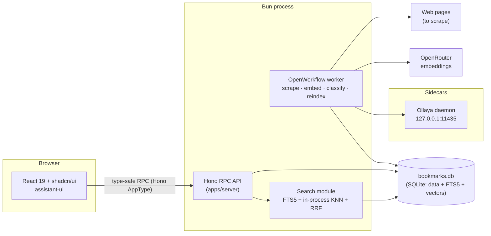
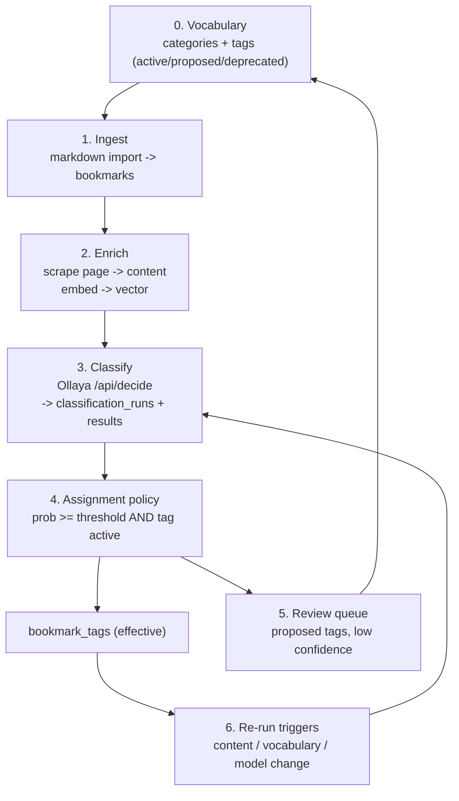

# al-yo-bo — Architecture

> Reference document. It describes the intended shape of the system, the cross-cutting decisions,
> and the subsystems that are not obvious from the code. It is written to be safe for humans and
> agents to rely on: decisions are stated explicitly and each one has a rationale.
>
> Related docs: [README](../README.md) (human overview), [MODEL.md](./MODEL.md) (data model),
> [DESIGN.md](./DESIGN.md) (UI system), [AGENTS.md](../AGENTS.md) (agent instructions).

## 1. Principles & constraints

These constrain every later decision. A change that violates one needs an explicit note here first.

1. **Bun-native.** Prefer Bun's built-in APIs and ecosystem. Node only when a dependency forces it.
2. **One SQLite file.** Relational data, full-text search, and vector data live in the same SQLite
   database. No second store, no side-car database file.
3. **Self-hosted, no external server.** A single-user tool. Running it must not require Meilisearch,
   Qdrant, Redis, or a hosted vector service.
4. **Docs-first.** Architecture, data model, and design are decided in `docs/` before code. Prefer
   well-documented, open-source components over bespoke infrastructure.
5. **Classifier is optional.** Search, tagging, and browsing must all work with the classifier
   offline or absent. Classification enriches; it never gates core features.

## 2. Technology stack

The stack is chosen to satisfy §1. Changing a row here means updating the subsystem section that
depends on it.

| Layer           | Choice                               | Notes                                                                                    | URL                                                                                                  |
| --------------- | ------------------------------------ | ---------------------------------------------------------------------------------------- | ---------------------------------------------------------------------------------------------------- |
| Runtime         | **Bun**                              | Node only if a dependency forces it                                                      | [bun.com](https://bun.com)                                                                           |
| Web framework   | **Hono**                             | server routes                                                                            | [hono.dev](https://hono.dev)                                                                         |
| Reactive client | **React 19 + Hono RPC**              | UI; bundled with **Vite**                                                                | [react.dev](https://react.dev), [hono.dev/docs/guides/rpc](https://hono.dev/docs/guides/rpc)         |
| UI components   | **shadcn/ui**                        |                                                                                          | [ui.shadcn.com](https://ui.shadcn.com)                                                               |
| Chat UI         | **assistant-ui**                     | AI SDK runtime                                                                           | [assistant-ui.com](https://assistant-ui.com)                                                         |
| Classifier      | **Ollaya**                           | open decision models, single binary, sidecar daemon                                      | [ollaya.dev](https://ollaya.dev)                                                                     |
| LLM access      | **AI SDK**                           | Ollama locally, OpenRouter in production                                                 | [ai-sdk.com](https://ai-sdk.com)                                                                     |
| Embeddings      | **OpenRouter** + **SQLite BLOBs**    | vectors stored in the same DB file                                                       | [openrouter.com](https://openrouter.com)                                                             |
| Search          | **SQLite FTS5** + **in-process KNN** | keyword + semantic, same DB, RRF fusion                                                  | [sqlite.org](https://sqlite.org)                                                                     |
| Background jobs | **OpenWorkflow**                     | durable workflows, SQLite, Bun-native                                                    | [openworkflow.dev](https://openworkflow.dev)                                                         |
| Configuration   | **env**                              |                                                                                          | [bun.com/docs/runtime/environment-variables](https://bun.com/docs/runtime/environment-variables)     |
| Deployment      | **shell scripts**                    | a `nohup bun run server.ts` on the server, shell script to copy and unpack a dist archive |                                                                                                      |

Patterns worth studying while scaffolding: [Hono RPC and React Monorepo Template](https://vladimir.vovk.in/blog/hono-rpc-and-react-monorepo-template), [Bun SQL Backend for Frontend Devs](https://samuellawrentz.com/blog/bun-sql-backend-for-frontend-devs/) (the latter is a backend-only pattern — it says nothing about the web build).

**Web build (decided).** `apps/web` is a Vite + React 19 SPA. Vite is used for local dev and the
production build (`apps/web/dist`) because shadcn/ui's CLI targets Vite and Bun's fullstack bundler
does not yet apply plugins (Tailwind included) in its production CLI build. This does not weaken the
Bun-native constraint: Bun stays the runtime, package manager, test runner, and server, and in
production the same Bun process serves the built assets through Hono (`serveStatic`), so §9 still
describes a single process. The trigger to revisit this is in §11.

## 3. System overview

The app is one Bun process that serves the API, hosts the worker, and talks to a small number of
external participants. Everything durable is in the SQLite file.



**Processes.** The API and the worker are separate entry points of the same repo; in the default
single-user deployment they may share one process, but nothing assumes it. The worker is a
durability boundary (see §8), so it is shown separately.

**External participants.**

- **Ollaya** — the classifier decision daemon, an independent single binary. Runs next to the Bun
  server as a sidecar (§7, §9). Never a Node dependency.
- **OpenRouter** — embedding provider. Optional at the database level: bookmarks without embeddings
  are still findable by keyword.
- **The open web** — fetched by the scraper job only; the app never proxies page loads for the UI.

## 4. Monorepo layout

Bun workspaces. The goal is a small, acyclic package graph, not an exhaustive taxonomy.

```
apps/
  server/          Hono routes, RPC contract, worker entry, bootstrapping
  web/             React 19 app (shadcn/ui, assistant-ui), talks to server via Hono RPC
packages/
  db/              schema, migrations, PRAGMAs, typed queries
  search/          FTS5 + in-process KNN + RRF fusion
  classifier/      Ollaya client (ClassifierClient interface + adapter)
  importer/        markdown collection-file parser and ingest
  shared/          domain types + utilities (no framework imports)
```

**Dependency direction** (arrows = "may import"):

```
web ─▶ shared
server ─▶ db, search, classifier, importer, shared
db, search, classifier, importer ─▶ shared
```

Rules:

- `shared` imports nothing from the app (no Hono, no Bun-specific runtime, no database client).
- `db` owns all SQL; no other package opens the database directly.
- `search` and `classifier` take and return plain data, so they are testable without a running server.
- No cycles. `server` is the only package allowed to depend on a concrete implementation of each
  subsystem.

**Hono RPC typing.** `apps/server` exports its route type (`export type AppType = typeof routes`);
`apps/web` imports it **as a type only** and derives a typed client. This keeps the contract in one
place and adds no build-time coupling to server code.

## 5. Data & storage

The schema, invariants, and deletion semantics are owned by [MODEL.md](./MODEL.md). Architecture only
fixes the storage posture:

- **Single file.** All tables, the FTS5 index, and the embedding vectors live in one SQLite database
  (constraint §1.2). Backups are a file copy.
- **Migrations.** Numbered, forward-only SQL files under `packages/db`, applied at startup in a
  transaction. The server-set timestamp triggers (`created_at`/`updated_at`) belong here.
- **PRAGMAs.** `foreign_keys = ON`, WAL journaling, and a sensible `busy_timeout` are set on every
  connection.

## 6. Search subsystem

**Decision: SQLite FTS5 (keyword) + in-process brute-force KNN (semantic), fused app-side with
Reciprocal Rank Fusion (RRF).** Vectors are stored as BLOBs in a regular table and scanned in
memory.

### Why this and not a dedicated engine

The alternative search layers were evaluated against the constraints in §1 and rejected:

- **zvec-node** (Alibaba Zvec Node bindings) — a real, active engine with native BM25 + ANN + hybrid
  fusion (Logseq ships it), but it stores a **directory per collection** (breaks the one-file rule),
  is a native N-API addon with **no Bun support/testing**, and its binding repo is tiny and pre-v1.
  Worth revisiting only if the collection outgrows brute force and the constraints can relax.
- **ruvector** (ruvnet) — experimental: effectively single-author, open correctness bugs in core
  query paths, hybrid search not integrated into the main API, and it uses a **second storage file**
  (redb). Rejected.
- **sqlite-vec** — the previous plan. It works with `bun:sqlite` on Linux with zero configuration,
  but on macOS `bun:sqlite` uses Apple's system SQLite, which disables extension loading; loading
  `sqlite-vec` therefore requires `brew install sqlite` plus `Database.setCustomSQLite(...)` **before
  the first database is opened**. This is still true in current Bun releases. It stays as the
  documented fallback if SQL-integrated vectors are preferred over zero native dependencies.
- **Orama / LanceDB / DuckDB VSS / Meilisearch / Typesense / Qdrant** — either a second persistence
  format, an N-API fragility, or an external server. All fail §1.2 or §1.3.

### At personal scale, brute force is enough

A benchmark on the reference machine (Bun 1.4.2, arm64, top-k = 10) measured a pre-normalized
`Float32Array` matrix scan (cosine = dot product):

| dims | 1,000 docs | 10,000 docs | 50,000 docs | matrix @ 10k |
| ---- | ---------- | ----------- | ----------- | ------------ |
| 1536 | 1.4 ms p50 | 14.2 ms p50 | 68.9 ms p50 | 61 MB        |
| 512  | 0.5 ms p50 | 4.8 ms p50  | 22.7 ms p50 | 20 MB        |

`sqlite-vec` is itself brute-force internally — its ANN indexes exist only as unreleased alphas — so
the only real difference is *where* the loop runs, not the algorithm. For a single user's bookmark
collection this is millisecond-level and dependency-free. The revisit conditions are in §11.

### Data layout and lifecycle

- `bookmark_embeddings` is a regular STRICT table: `bookmark_id` (BLOB UUIDv7, PK, FK cascade),
  `dims`, `model`, `embedding` (BLOB, little-endian Float32), `updated_at`. See MODEL.md.
- On startup, `packages/search` loads all embeddings into one contiguous matrix and normalizes it
  once. The bookmark id order is kept alongside the matrix so a top-k index maps back to a bookmark.
- Writes go through the table **and** update the in-memory matrix (write-through), so newly embedded
  bookmarks are searchable without a reload.
- Embedding dimension is determined by `EMBEDDING_MODEL`. All rows must share it; a model change
  requires a re-embed pass, not a mixed matrix.

### Query path

1. Keyword candidate list from FTS5 (BM25 ranked).
2. Semantic candidate list from the in-memory top-k scan.
3. RRF fusion (`k = 60`) merges the two ranked lists into the final order; optional filters
   (category/tag) are applied to the fused candidates.

**Degradation.** If embeddings are unavailable (no OpenRouter key, empty matrix, not yet loaded),
search automatically returns keyword-only results. This is a normal state, not an error.

## 7. Classifier workflow

Classification turns raw bookmarks into curated tag assignments with **immutable evidence** and
**human review** for anything uncertain. The rules come from MODEL.md: classification never invents
vocabulary; only `active` tags are auto-assigned; every effective tag can be traced to the run that
produced it.

**Participants.** Importer job · scraper/embedder jobs · Ollaya decision daemon · assignment policy
(app code) · review UI (user).



### Stage 0 — Vocabulary

The user curates categories and tags in the UI. Tag lifecycle: `proposed → active → deprecated`.

**Candidate set (decided).** For a bookmark, candidates are the `active` tags in its category scope:

- tags with `tags.category_id = bookmarks.category_id`, plus
- unscoped tags (`tags.category_id IS NULL`).

If the bookmark has no category, **all active tags** are candidates — there is no scope to restrict
to, and restricting to unscoped tags only would systematically under-classify.

### Stage 1 — Ingest (import)

Markdown collection files (see [examples-mds](./examples-mds)) use `## Category` headings and bullet
entries containing a URL plus an optional note and optional priority stars.

**Mapping rules (decided):**

| Source element            | Maps to                                            |
| ------------------------- | -------------------------------------------------- |
| `## Heading` (H2)         | category, created on demand                        |
| `### Heading` (H3)        | section context, **not** a category or tag         |
| `*` / `**` / `***` prefix | personal priority (1–3), **not** a tag             |
| bullet note               | `title` / `description` until the page is scraped  |
| URL                       | `bookmarks.url` (unique; upsert key)               |

Structure never creates tags. `metadata.import` preserves what would otherwise be lost
(`{ file, section, subsection, priority }`), so review and future tooling can use it.

`source='import'` tag rows are written **only** for explicit inline tags in a note (a token matching
an existing tag). The importer never invents tags and never creates `proposed` ones.

### Stage 2 — Enrich (background jobs)

- **Scrape.** Fetch the page, store `content` (markdown), `metadata` (JSON), `content_hash`, and
  `scraped_at`. If the hash is unchanged, nothing downstream is re-run.
- **Embed.** Compose the embed text (title + description + content, truncated to the embedding
  model's limits) and call OpenRouter. Store the vector with its `model` and `dims`. Refresh on
  content-hash change. Enqueue re-classification when content changes.

### Stage 3 — Classify (Ollaya)

Build a `state` string from the bookmark: title, description, URL host, and a content excerpt.

> **Context limit.** `laya:en` accepts 512 tokens and `laya:multilingual` accepts 1024. **Decided
> policy:** classify the lead excerpt — title + description + the first ~350 tokens of content.
> Chunked classification (per-chunk calls, max probability per tag) is deliberately deferred until
> evidence shows systematic misses; see §11.

Represent the candidate tags as questions. For multi-label tagging, use one `noul` (yes/no) question
per candidate tag, batched by category scope and capped per call. A bookmark may therefore produce
one or more runs.

```
POST http://127.0.0.1:11435/api/decide
{
  "model": "laya",
  "state": "…title, description, url host, excerpt…",
  "questions": {
    "<tag name>": { "type": "noul", "instructions": "…", "criteria": {"true": "…", "false": "…"} }
  }
}
```

Ollaya resolves the requested alias to a concrete checkpoint (for example `laya` → `laya:en`). Persist
the **resolved checkpoint** in `classification_runs.model`; keep the Ollaya runtime version in
`classifier_version`.

Persist results:

- one `classification_runs` row per call (`classifier = 'ollaya'`);
- one `classification_results` row per candidate (`probability`, `rank`, `selected = 0`, and the
  `raw_label` exactly as sent).

If a returned label maps to no existing tag, create a `proposed` tag and attach the result to it. It
is **never** auto-assigned.

### Stage 4 — Assignment policy (deterministic)

A result becomes effective only when **both** hold:

1. `probability ≥ auto_assign threshold` (configuration), and
2. the tag's status is `active`.

Then set `selected = 1` and upsert `bookmark_tags` with `source='classifier'`, `confidence`, and
`run_id` (the evidence link). Results below the threshold remain evidence and surface in the review
queue.

**User rows win (decided).** Classifier re-runs skip `source='user'` rows entirely — they are never
overwritten. Re-running appends new evidence; the effective state is recomputed under the current
policy without rewriting history. Known limitation: user *removals* are not tracked as negative
evidence, so a later run can re-assign a removed tag; if that becomes annoying, add a suppression
table in a later model revision (§11).

### Stage 5 — Review (human-in-the-loop)

The UI presents review queues:

- **Proposed tags** — approve (`→ active`, enables future auto-assignment for that tag) or reject
  (`→ deprecated`).
- **Below-threshold candidates** — accept, which writes `bookmark_tags` with `source='user'`.
- **Stale / conflicting assignments** — resolve explicitly.

### Stage 6 — Re-run triggers

Re-classify on: content-hash change, vocabulary change (new active tags in scope), model or threshold
change, or an explicit manual request. At most one classification is in flight per bookmark.

### Failure & degradation

If Ollaya is unreachable, the job retries with backoff (see §8); the bookmark remains browsable,
searchable, and manually taggable. The classifier is optional by design (§1.5). Ollaya is currently
**Beta and pre-1.0**, so it sits behind a thin `ClassifierClient` boundary — one adapter module in
`packages/classifier` — so it can be pinned, upgraded, or swapped without touching the workflow.

### Configuration

| Env var                 | Purpose                                       | Default                  |
| ----------------------- | --------------------------------------------- | ------------------------ |
| `OLLAYA_URL`            | Ollaya daemon base URL                        | `http://127.0.0.1:11435` |
| `OLLAYA_API_KEY`        | Bearer key when the daemon is exposed         | unset (loopback)         |
| `OLLAYA_MODEL`          | Decision model alias                          | `laya`                   |
| `AUTO_ASSIGN_THRESHOLD` | Minimum probability to auto-assign a tag      | unset — must be chosen   |
| `OPENROUTER_API_KEY`    | Embedding provider credential                 | unset                    |
| `EMBEDDING_MODEL`       | Embedding model (fixes the vector dimensions) | unset — must be chosen   |

## 8. Background jobs

Durable work runs on **OpenWorkflow** (SQLite-backed, Bun-native). Job types:

| Job        | Input            | Effect                                                          |
| ---------- | ---------------- | --------------------------------------------------------------- |
| `scrape`   | bookmark id      | fetch page → content/metadata/hash; enqueue `embed`, `classify` |
| `embed`    | bookmark id      | vector via OpenRouter → `bookmark_embeddings`                   |
| `classify` | bookmark id      | Ollaya → runs/results → assignment policy                       |
| `reindex`  | bookmark/tag/all | rebuild FTS rows or refresh the in-memory matrix                |

Retries are exponential with a bounded cap; jobs are idempotent (safe to re-run). Concurrency guards:
one in-flight classification per bookmark and one scrape per URL. Failures never lose a bookmark —
the row is always saved first, enrichment is best-effort.

## 9. Deployment

Single-user, shell-script driven. The documented shape is `nohup bun run apps/server …` on the host,
with a scripted archive copy to ship a new build. Two processes must be running:

0. the **web build** (`bun run build` → `apps/web/dist`), produced ahead of the server start, and
1. the **Bun server** (API + worker, which also serves `apps/web/dist`), and
2. the **Ollaya sidecar** (systemd unit or Docker), with its models pulled once
   (`ollaya pull laya`).

The SQLite file and its WAL sidecars are the only state to back up. Ollaya keeps no bookmark state —
it is stateless with respect to this app. Configuration is entirely environment variables (§7).

## 10. Failure modes & degradation

| Failure                   | Effect                                                                     |
| ------------------------- | -------------------------------------------------------------------------- |
| OpenRouter unreachable    | Embeddings not produced; search is keyword-only; classification still runs |
| Ollaya unreachable        | No new classifications; manual tagging unaffected; jobs retry              |
| Scrape fails              | Bookmark persists as URL + note; keyword search still matches it           |
| Classifier model upgraded | New runs recorded; old runs retained; effective tags re-policyable         |
| Search matrix not loaded  | Automatic keyword-only fallback                                            |

## 11. Revisit triggers

Decisions here are final for v1, but each has an explicit condition that reopens it. When a trigger
fires, revisit the section, run a fresh benchmark or evaluation, and update this document.

| Decision                         | Revisit when                                                                                                                                                                         |
| -------------------------------- | ------------------------------------------------------------------------------------------------------------------------------------------------------------------------------------ |
| Brute-force KNN (§6)             | Collection exceeds ~50,000 bookmarks, semantic p95 exceeds ~100 ms, or the matrix exceeds ~512 MB of RAM. Re-evaluate sqlite-vec's ANN alphas, zvec, or another engine then.          |
| Lead-excerpt classification (§7) | Evaluation shows systematic tag misses on long pages; then add chunked classification with per-tag max aggregation.                                                                   |
| User-removal semantics (§7)      | Users report re-assigned removed tags; then add a suppression (negative evidence) table to MODEL.md.                                                                                  |
| Importer inline tags (§7)        | `source='import'` syntax appears in real collection files; then define the marker grammar in the importer spec.                                                                       |
| Web bundler (§2)                 | Bun's bundler applies plugins (Tailwind/shadcn) in its production CLI build and the fullstack API stabilizes; then re-evaluate dropping Vite for a fully Bun-native build.            |
