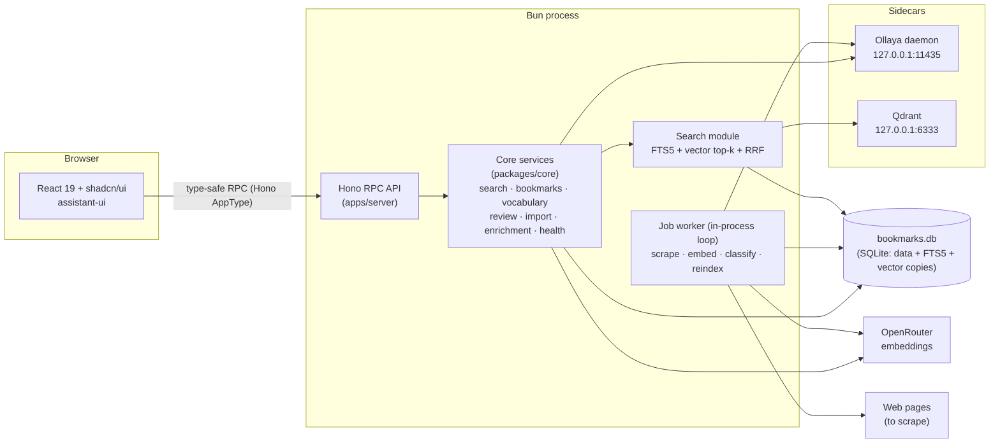
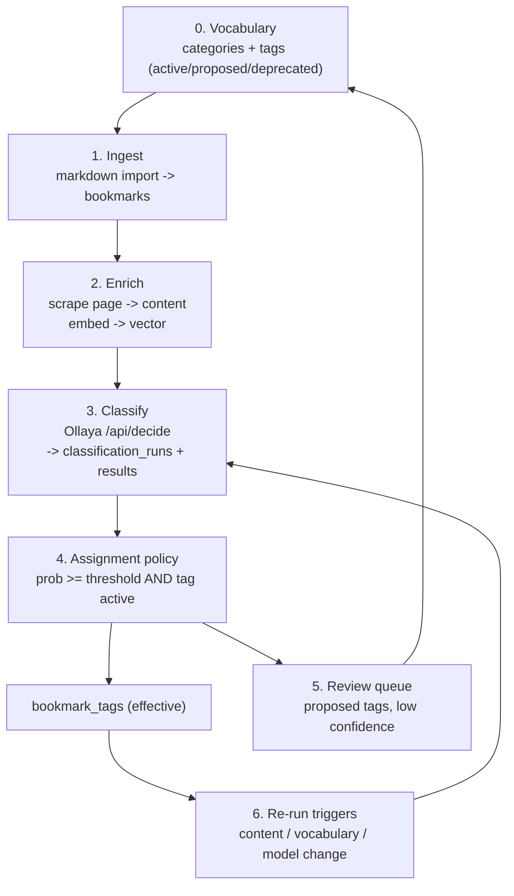

# al-yo-bo — Architecture

> Reference document. It describes the intended shape of the system, the cross-cutting decisions,
> and the subsystems that are not obvious from the code. It is written to be safe for humans and
> agents to rely on: decisions are stated explicitly and each one has a rationale.
>
> Related docs: [README](../README.md) (human overview), [MODEL.md](./MODEL.md) (data model),
> [DESIGN.md](./DESIGN.md) (UI system), [AGENTS.md](../AGENTS.md) (agent instructions).

## 1. Principles & constraints

These constrain every later decision. A change that violates one needs an explicit note here first.

1. **Bun-native.** Prefer Bun's built-in APIs and ecosystem. Node only when a dependency forces it.
2. **One durable store.** Relational data, full-text search, and the durable copy of the vector data
   live in one SQLite file. Nothing else ever holds the only copy of durable data. Rebuildable
   *serving* structures may live outside the file (FTS5 inside it; a local Qdrant collection outside
   it): losing one is repaired from SQLite without re-embedding (§6).
3. **Self-hosted, local single binaries only.** A single-user tool. It must never require a hosted or
   cloud service. Optional sidecars must be single local binaries (Ollaya, Qdrant) and every feature
   must degrade gracefully when a sidecar is down.
4. **Docs-first.** Architecture, data model, and design are decided in `docs/` before code. Prefer
   well-documented, open-source components over bespoke infrastructure.
5. **Classifier is optional.** Search, tagging, and browsing must all work with the classifier
   offline or absent. Classification enriches; it never gates core features.

## 2. Technology stack

The stack is chosen to satisfy §1. Changing a row here means updating the subsystem section that
depends on it.

| Layer           | Choice                               | Notes                                                                                    | URL                                                                                                  |
| --------------- | ------------------------------------ | ---------------------------------------------------------------------------------------- | ---------------------------------------------------------------------------------------------------- |
| Runtime         | **Bun**                              | Node only if a dependency forces it                                                      | [bun.com](https://bun.com)                                                                           |
| Web framework   | **Hono**                             | server routes                                                                            | [hono.dev](https://hono.dev)                                                                         |
| Reactive client | **React 19 + Hono RPC**              | UI; bundled with **Vite**                                                                | [react.dev](https://react.dev), [hono.dev/docs/guides/rpc](https://hono.dev/docs/guides/rpc)         |
| UI components   | **shadcn/ui**                        |                                                                                          | [ui.shadcn.com](https://ui.shadcn.com)                                                               |
| Chat UI         | **assistant-ui**                     | AI SDK runtime                                                                           | [assistant-ui.com](https://assistant-ui.com)                                                         |
| Classifier      | **Ollaya**                           | open decision models, single binary, sidecar daemon                                      | [ollaya.dev](https://ollaya.dev)                                                                     |
| LLM access      | **AI SDK**                           | Ollama locally, OpenRouter in production                                                 | [ai-sdk.com](https://ai-sdk.com)                                                                     |
| Embeddings      | **OpenRouter** + **SQLite BLOBs**    | durable vector copy in the DB file; query text embedded at request time                  | [openrouter.com](https://openrouter.com)                                                             |
| Vector serving  | **Qdrant** (single binary, sidecar)  | filtered top-k; in-process KNN is the offline fallback                                   | [qdrant.tech](https://qdrant.tech/documentation/)                                                    |
| Search          | **SQLite FTS5** + **RRF fusion**     | keyword (FTS5) + semantic (Qdrant/KNN), fused app-side                                   | [sqlite.org](https://sqlite.org)                                                                     |
| Background jobs | **In-process job loop** (Bun)         | sequential, idempotent jobs with bounded retries (§8)                                     |                                                                                                      |
| Configuration   | **env**                              |                                                                                          | [bun.com/docs/runtime/environment-variables](https://bun.com/docs/runtime/environment-variables)     |
| Deployment      | **shell scripts**                    | a `nohup bun run server.ts` on the server, shell script to copy and unpack a dist archive |                                                                                                      |

Patterns worth studying while scaffolding: [Hono RPC and React Monorepo Template](https://vladimir.vovk.in/blog/hono-rpc-and-react-monorepo-template), [Bun SQL Backend for Frontend Devs](https://samuellawrentz.com/blog/bun-sql-backend-for-frontend-devs/) (the latter is a backend-only pattern — it says nothing about the web build).

**Web build (decided).** `apps/web` is a Vite + React 19 SPA. Vite is used for local dev and the
production build (`apps/web/dist`) because shadcn/ui's CLI targets Vite and Bun's fullstack bundler
does not yet apply plugins (Tailwind included) in its production CLI build. This does not weaken the
Bun-native constraint: Bun stays the runtime, package manager, test runner, and server, and in
production the same Bun process serves the built assets through Hono (`serveStatic`), so §9 still
describes a single process. The trigger to revisit this is in §11.

## 3. System overview

The app is one Bun process that serves the API, hosts the worker, and talks to a small number of
external participants. Everything durable is in the SQLite file.



**Processes.** The API and the job worker run inside the same Bun process in the default
single-user deployment (the worker is an in-process loop, §8); nothing in the job code assumes
co-location, so extraction into a separate entry point stays possible. The worker is a
durability boundary (see §8), so it is shown separately.

**Transport vs. domain.** `apps/server` (the Hono API) is a thin transport adapter: it parses HTTP,
calls exactly one `packages/core` service, and maps domain errors to problem+json. `packages/core`
owns the application services — search orchestration, bookmark CRUD and its re-run triggers,
vocabulary, review, import, the enrichment queue, and health. The app edge constructs the concrete
adapters (Qdrant stack, OpenRouter embeddings, Ollaya client, scraper) and injects them as
interfaces, so core stays transport-neutral and testable without a server.

**External participants.**

- **Ollaya** — the classifier decision daemon, an independent single binary. Runs next to the Bun
  server as a sidecar (§7, §9). Never a Node dependency.
- **Qdrant** — the vector-serving sidecar, a single local binary (§6). Holds only a rebuildable
  serving copy of the embeddings; SQLite is canonical.
- **OpenRouter** — embedding provider (document vectors in the worker, query vectors in the API).
  Optional at the database level: bookmarks without embeddings are still findable by keyword.
- **The open web** — fetched by the scraper job only; the app never proxies page loads for the UI.

## 4. Monorepo layout

Bun workspaces. The goal is a small, acyclic package graph, not an exhaustive taxonomy.

```
apps/
  server/          Hono routes (transport adapters), RPC contract, worker entry, bootstrapping
  web/             React 19 app (shadcn/ui, assistant-ui), talks to server via Hono RPC
packages/
  db/              schema, migrations, PRAGMAs, typed queries
  search/          FTS5 + RRF fusion + in-process KNN (fallback VectorIndex)
  vectordb/        Qdrant client (VectorIndex adapter, collection sync)
  embeddings/      EmbeddingClient interface + OpenRouter adapter
  classifier/      Ollaya client (ClassifierClient interface + adapter)
  importer/        markdown collection-file parser and ingest
  core/            domain/application services (search, bookmarks, enrichment, ...); no HTTP
  shared/          domain types + utilities (no framework imports)
```

**Dependency direction** (arrows = "may import"):

```
web ─▶ shared
server ─▶ core, db, search, vectordb, embeddings, classifier, shared
core ─▶ db, importer, search, embeddings, classifier, shared
db, search, vectordb, embeddings, classifier, importer ─▶ shared
importer ─▶ db
```

Rules:

- `shared` imports nothing from the app (no Hono, no Bun-specific runtime, no database client).
  It owns the `VectorIndex` interface and the LE-Float32 BLOB codec shared by `search` and
  `vectordb`.
- `db` owns all SQL; only `apps/server` opens/sets up the SQLite file, then hands the handle to
  `core`. `core` composes typed `db` queries into application services but writes no SQL of its own;
  the Qdrant startup sync (which passes plain records into `packages/vectordb`) stays in
  `apps/server`.
- `core` is transport-neutral: it depends on the `EmbeddingClient`/`ClassifierClient` interfaces and
  a `VectorProvider` port, never on concrete adapters or Hono. It receives an already-open database
  and a vector provider; only `apps/server` constructs the concrete implementations.
- `search`, `vectordb`, `embeddings`, and `classifier` take and return plain data, so they are
  testable without a running server.
- No cycles. `server` is the only package allowed to depend on a concrete implementation of each
  subsystem; `web` depends on `server` only through its exported route type (type-only).

**Hono RPC typing.** `apps/server` exports its route type (`export type AppType = typeof routes`);
`apps/web` imports it **as a type only** and derives a typed client. This keeps the contract in one
place and adds no build-time coupling to server code.

## 5. Data & storage

The schema, invariants, and deletion semantics are owned by [MODEL.md](./MODEL.md). Architecture only
fixes the storage posture:

- **Single durable file.** All tables, the FTS5 index, and the embedding vectors live in one SQLite
  database (constraint §1.2). Backups are a file copy. The Qdrant collection is a derived serving
  structure (§6) and never needs backing up.
- **Migrations.** Numbered, forward-only SQL files under `packages/db`, applied at startup in a
  transaction. The server-set timestamp triggers (`created_at`/`updated_at`) belong here.
- **PRAGMAs.** `foreign_keys = ON`, WAL journaling, and a sensible `busy_timeout` are set on every
  connection.

## 6. Search subsystem

**Decision: SQLite FTS5 (keyword) + a Qdrant sidecar (semantic top-k), fused app-side with
Reciprocal Rank Fusion (RRF).** Vectors are durably stored as BLOBs in `bookmark_embeddings`;
Qdrant serves filtered top-k queries. An in-process brute-force KNN scan over the SQLite rows is
the automatic fallback whenever the sidecar is unreachable — it is kept warm at startup and never
a separately maintained path.

### Why a vector sidecar, and why Qdrant

The v1 plan served semantic search entirely from an in-process brute-force scan (kept below as the
fallback). Serving moved to Qdrant (decided Sep 2026) for three reasons: **server-side filtered
top-k** (category/tag filters are evaluated inside the vector query instead of after fusion), an
HNSW index with headroom past the brute-force revisit trigger, and a real ops story (snapshot API,
memory tiers). Both single-binary options were evaluated:

- **Qdrant** (chosen) — one static binary (~30 MB, macOS arm64 / Linux musl), snapshot API for
  backups, payload filtering with per-field keyword indexes inside top-k, point ids are native UUID
  strings (our bookmark UUIDv7s map directly), mmap-based memory control. REST client works under
  Bun (gRPC does not; the undici dispatcher it configures is ignored by Bun's shim — pinned
  `@qdrant/js-client-rest`, REST only).
- **Chroma** (rejected) — the fetch-only JS client is explicitly Bun-tested (a plus), but the OSS
  server has **no backup API** (consistent copy requires quiescing writers and copying the data
  directory), hybrid/RRF is Chroma-Cloud-only, the Linux binary is ~512 MB, HNSW memory cannot be
  tuned down, and unpatched advisories existed at evaluation time.

Both contradict the original "no side-car database file" reading, which is why §1.2 was reworded to
separate the **durable** store (SQLite) from **rebuildable serving** structures. Qdrant is to
semantic search exactly what FTS5 is to keyword search: derived, disposable, repaired from the
database at startup. **sqlite-vec** remains the documented fallback if a SQL-integrated index is
ever preferred over a sidecar (same trade as before: system SQLite on macOS cannot load
extensions).

The remaining v1 rejections stand: **zvec-node** (collection-per-directory, native addon without
Bun support), **ruvector** (experimental, second storage file), **Orama / LanceDB / DuckDB VSS /
Meilisearch / Typesense** (second persistence format, N-API fragility, or external server).

### At personal scale, the fallback alone is enough

A benchmark on the reference machine (Bun 1.4.2, arm64, top-k = 10) measured a pre-normalized
`Float32Array` matrix scan (cosine = dot product):

| dims | 1,000 docs | 10,000 docs | 50,000 docs | matrix @ 10k |
| ---- | ---------- | ----------- | ----------- | ------------ |
| 1536 | 1.4 ms p50 | 14.2 ms p50 | 68.9 ms p50 | 61 MB        |
| 512  | 0.5 ms p50 | 4.8 ms p50  | 22.7 ms p50 | 20 MB        |

This is why the fallback is viable: when Qdrant is down, semantic search still answers in
milliseconds at bookmark-collection scale. The Qdrant sidecar buys filtered top-k and headroom, not
raw speed at this size. The revisit conditions are in §11.

### Data layout and lifecycle

- `bookmark_embeddings` is the **durable** copy: a regular STRICT table (`bookmark_id` BLOB UUIDv7,
  PK, FK cascade, `dims`, `model`, `embedding` BLOB little-endian Float32, `updated_at`). See
  MODEL.md. Backups are the SQLite file copy.
- The Qdrant collection (default `bookmarks`) holds one point per embedding: point id = bookmark
  UUID, cosine space, payload `{ model, dims, categoryId, tagIds }` with keyword payload indexes on
  the filter fields, and collection metadata `{ model }`.
- **All rows must share one dimension** (fixed by `EMBEDDING_MODEL`); a model change requires a
  re-embed pass. On startup the collection is checked against the SQLite rows: a dims/model
  mismatch drops and recreates it, and `sync` replays SQLite rows into missing points and deletes
  orphans. Qdrant data loss is therefore free to recover — never re-embed.
- **`bookmark_embeddings.model` stores the configured `EMBEDDING_MODEL`**, not the provider's
  response echo: OpenRouter normalizes model ids (e.g. `text-embedding-3-small` for
  `openai/text-embedding-3-small`), and storing the echo would flag every row as stale on every
  startup, re-embedding the whole library forever. The startup reconciliation compares rows against
  the configured model, so a genuine model change re-embeds exactly once.
- Write-through order: SQLite first (canonical), then the index (Qdrant point and in-memory matrix).
  Index writes are best-effort; a missed write is repaired by the next startup sync.
- `packages/search` loads all SQLite embeddings into one contiguous normalized matrix at startup
  (the fallback), and `FallbackVectorIndex` routes reads/writes to Qdrant with a 30 s failure
  cooldown before falling back. Filters are pushed into the Qdrant query; on the fallback path they
  are applied client-side after an 8× overfetch, with payloads resolved from SQLite in one query.
  The boot-time `sync` is retried for a few seconds before that fallback engages, because
  `bun run dev` starts the sidecar in parallel and it may still be binding :6333.

### Query path

1. Keyword candidate list from FTS5 (BM25 ranked).
2. Semantic candidate list: embed the query text via OpenRouter, then filtered top-k from the
   vector index (Qdrant server-side filter, or fallback overfetch+filter).
3. RRF fusion (`k = 60`) merges the two ranked lists into the final order.

**Degradation.** Any missing link — no OpenRouter key/model, empty vector set, Qdrant down —
returns keyword-only results. This is a normal state, not an error.

## 7. Classifier workflow

Classification turns raw bookmarks into curated tag assignments with **immutable evidence** and
**human review** for anything uncertain. The rules come from MODEL.md: classification never invents
vocabulary; only `active` tags are auto-assigned; every effective tag can be traced to the run that
produced it.

**Participants.** Importer job · scraper/embedder jobs · Ollaya decision daemon · assignment policy
(app code) · review UI (user).



### Stage 0 — Vocabulary

The user curates categories and tags in the UI, dataset-scoped. Tag lifecycle:
`proposed → active → deprecated` (or `proposed → rejected`); categories share the
`proposed → active → rejected` lifecycle.

**Vocabulary establishment (decided).** Vocabulary is established at **dataset init** and at every
**batch import**, through a **propose → review → activate** lifecycle:

- The importer never creates active categories/tags on demand. Unmatched H2/H3 headings and
  frontmatter tag names become `proposed` sections/categories/tags, and the import is **staged** in
  `import_batches` until the user reviews the proposals.
- Review resolves each proposal (accept → `active`, reject → `rejected`, rename, or merge with
  `merged_into_id`). Committing the batch replays the staged bookmarks through the resolved
  vocabulary.
- Rejected/renamed entries are remembered (`status = 'rejected'` + `merged_into_id`), so a re-import
  of the same file resolves them silently instead of re-proposing.
- A dataset with no content yet (fresh init) runs the same flow over the whole incoming vocabulary.

**Candidate set (decided).** For a bookmark, candidates are the `active` tags **in its dataset**:

- tags with `tags.dataset_id = bookmarks.dataset_id`, plus (when the bookmark has a category) tags in
  its category scope and unscoped tags — all still within the dataset.
- If the bookmark has no category, all active tags in its dataset are candidates.

Cross-dataset vocabulary is never a candidate, which is what prevents a demo dataset's tags from
leaking into a personal dataset.

### Stage 1 — Ingest (import)

Markdown collection files (see [examples-mds](./examples-mds)) use `## Category` headings and bullet
entries containing a URL plus an optional note and optional priority stars.

**Mapping rules (decided):**

| Source element             | Maps to                                                          |
| -------------------------- | ---------------------------------------------------------------- |
| `## Heading` (H2)          | section, proposed on review                                       |
| `### Heading` (H3)         | category within the current section, proposed on review           |
| `*` / `**` / `***` prefix  | personal priority (1–3), **not** a tag                            |
| bullet note                | `title` / `description` until the page is scraped                |
| URL                        | `bookmarks.url` (unique; upsert key)                             |
| frontmatter `tags: [a, b]` | `source='import'` tag rows, for names already in the vocabulary   |
| fenced code block          | opaque — never a heading, bullet, or URL source                  |

**Two-phase import (decided).** Import parses first, then resolves vocabulary, then commits:

1. Parse the file into `ImportedBookmark[]` (raw H2/H3 names preserved in `metadata.import`).
2. Resolve each raw name against the dataset's vocabulary: reuse `active` entries; follow
   `merged_into_id` for `rejected` ones; create `proposed` entries for anything unmatched.
3. If any proposal was created, the import is **staged** (`import_batches`, status `staged`) and the
   batch is surfaced for review. Nothing is written to `bookmarks` yet.
4. After review resolves the proposals, the batch is **committed**: bookmarks are upserted with the
   resolved categories/tags, and a scrape is enqueued for each new bookmark. A batch can also be
   **discarded**, deleting its still-`proposed` vocabulary.

Structure never creates tags, and frontmatter tag names are matched against existing tags only.
`metadata.import` preserves what would otherwise be lost (`{ file, section, subsection, priority }`),
so review and future tooling can use it.

`source='import'` tag rows are written **only** for explicit YAML frontmatter `tags:` whose name
matches an existing tag. The importer never invents tags and never creates `proposed` ones from
structure. (Inline-token tag syntax inside a note remains deferred; see §11.)

### Stage 2 — Enrich (background jobs)

- **Scrape.** Fetch the page, store `content` (markdown), `metadata` (JSON), `content_hash`, and
  `scraped_at`. If the hash is unchanged, nothing downstream is re-run.
- **Embed.** Compose the embed text (title + description + content, truncated to the embedding
  model's limits) and call OpenRouter. Store the vector with its `model` and `dims`. Refresh on
  content-hash change. Enqueue re-classification when content changes.

### Stage 3 — Classify (Ollaya)

Build a `state` string from the bookmark: title, description, URL host, and a content excerpt.

> **Context limit.** `laya:en` accepts 512 tokens and `laya:multilingual` accepts 1024. **Decided
> policy:** classify the lead excerpt — title + description + the first ~350 tokens of content.
> Chunked classification (per-chunk calls, max probability per tag) is deliberately deferred until
> evidence shows systematic misses; see §11.

Represent the candidate tags as questions. For multi-label tagging, use one `noul` (yes/no) question
per candidate tag, batched by category scope and capped per call. A bookmark may therefore produce
one or more runs.

```
POST http://127.0.0.1:11435/api/decide
{
  "model": "laya",
  "state": "…title, description, url host, excerpt…",
  "questions": {
    "<tag name>": { "type": "noul", "instructions": "…", "criteria": {"true": "…", "false": "…"} }
  }
}
```

Ollaya resolves the requested alias to a concrete checkpoint (for example `laya` → `laya:en`). Persist
the **resolved checkpoint** in `classification_runs.model`; keep the Ollaya runtime version in
`classifier_version`.

Persist results:

- one `classification_runs` row per call (`classifier = 'ollaya'`);
- one `classification_results` row per candidate (`probability`, `rank`, `selected = 0`, and the
  `raw_label` exactly as sent).

If a returned label maps to no existing tag, create a `proposed` tag and attach the result to it. It
is **never** auto-assigned.

### Stage 4 — Assignment policy (deterministic)

A result becomes effective only when **both** hold:

1. `probability ≥ auto_assign threshold` (configuration), and
2. the tag's status is `active`.

Then set `selected = 1` and upsert `bookmark_tags` with `source='classifier'`, `confidence`, and
`run_id` (the evidence link). Results below the threshold remain evidence and surface in the review
queue.

**User rows win (decided).** Classifier re-runs skip `source='user'` rows entirely — they are never
overwritten. Re-running appends new evidence; the effective state is recomputed under the current
policy without rewriting history. Known limitation: user *removals* are not tracked as negative
evidence, so a later run can re-assign a removed tag; if that becomes annoying, add a suppression
table in a later model revision (§11).

### Stage 5 — Review (human-in-the-loop)

The UI presents review queues:

- **Proposed vocabulary (per-batch)** — sections, categories, and tags proposed by an import (or the
  classifier). Bulk accept (`→ active`), reject (`→ rejected`), rename, and merge near-duplicates
  (auto-suggested + manual). Rejected/merged entries record `merged_into_id` so re-imports resolve
  them silently.
- **Proposed tags** — classifier-proposed tags; approve (`→ active`, enables future auto-assignment
  for that tag) or reject (`→ rejected`).
- **Below-threshold candidates** — accept, which writes `bookmark_tags` with `source='user'`.
- **Stale / conflicting assignments** — resolve explicitly.

### Stage 6 — Re-run triggers

Re-classify on: content-hash change, vocabulary change (new active tags in scope), model or threshold
change, or an explicit manual request. At most one classification is in flight per bookmark.

### Failure & degradation

If Ollaya is unreachable, the job retries with backoff (see §8); the bookmark remains browsable,
searchable, and manually taggable. The classifier is optional by design (§1.5). Ollaya is currently
**Beta and pre-1.0**, so it sits behind a thin `ClassifierClient` boundary — one adapter module in
`packages/classifier` — so it can be pinned, upgraded, or swapped without touching the workflow.

### Configuration

| Env var                 | Purpose                                       | Default                  |
| ----------------------- | --------------------------------------------- | ------------------------ |
| `OLLAYA_URL`            | Ollaya daemon base URL                        | `http://127.0.0.1:11435` |
| `OLLAYA_API_KEY`        | Bearer key when the daemon is exposed         | unset (loopback)         |
| `OLLAYA_MODEL`          | Decision model alias                          | `laya`                   |
| `AUTO_ASSIGN_THRESHOLD` | Minimum probability to auto-assign a tag      | `0.5`                    |
| `DEFAULT_DATASET`       | Dataset new bookmarks/imports land in when none is specified | `default` |
| `OPENROUTER_API_KEY`    | Embedding provider credential                 | unset                    |
| `OPENROUTER_BASE_URL`   | Embeddings API base URL (OpenAI-compatible)   | `https://openrouter.ai/api/v1` |
| `EMBEDDING_MODEL`       | Embedding model (fixes the vector dimensions) | `openai/text-embedding-3-small` |
| `QDRANT_URL`            | Qdrant REST base URL; empty string disables the sidecar | `http://127.0.0.1:6333` |
| `QDRANT_COLLECTION`     | Qdrant collection name                        | `bookmarks`              |
| `QDRANT_API_KEY`        | Bearer key when Qdrant is exposed             | unset (loopback)         |
| `QDRANT_TIMEOUT_MS`     | Client fetch timeout for Qdrant requests      | `5000`                   |
| `SEED_DATASET`          | Dataset `bun run db:seed` loads (registered in `packages/db/src/seed.ts`; seed-script only) | `leo` |
| `SEED_RESET`            | When `1`, `db:seed` wipes bookmarks/tags/categories before loading (seed-script only) | unset |

## 8. Background jobs

**Decision: jobs run on a minimal in-process loop inside the Bun server.**
The loop is sequential (one job at a time), deduplicates per `(bookmark, type)` so at most one job
of each type is in flight per bookmark, and retries failures with bounded exponential backoff.
Jobs are idempotent, and SQLite holds the durable state that defines what still needs doing
(`content_hash`/`scraped_at` for scraping, `bookmark_embeddings` rows for embedding), so the queue
itself is deliberately in-memory: on startup a **reconciliation pass** re-enqueues scrape for
bookmarks without scraped content and embed for bookmarks without embeddings, which recovers
anything a restart dropped. Failures after the retry cap are logged and dropped; the manual
re-scrape endpoint re-enqueues. The trigger to re-evaluate the job architecture is in §11.

Job types:

| Job        | Input            | Effect                                                          |
| ---------- | ---------------- | --------------------------------------------------------------- |
| `scrape`   | bookmark id      | fetch page → content/metadata/hash; enqueue `embed`, `classify` |
| `embed`    | bookmark id      | vector via OpenRouter → `bookmark_embeddings` (durable), then write-through to the vector index |
| `classify` | bookmark id      | Ollaya → runs/results → assignment policy                       |
| `reindex`  | bookmark/tag/all | rebuild FTS rows, or sync the Qdrant collection from SQLite rows |

Retries are exponential with a bounded cap; jobs are idempotent (safe to re-run). Concurrency guards:
one in-flight classification per bookmark and one scrape per URL. Failures never lose a bookmark —
the row is always saved first, enrichment is best-effort.

### Scrape implementation

The scraper fetches the page itself (browser-like UA, `SCRAPE_TIMEOUT_MS` budget, redirect
follow) and pipes the HTML into the locally installed **`html-to-markdown` CLI**
(<https://github.com/xberg-io/html-to-markdown>) over stdin/stdout — no npm dependency, no native
addon. The binary is treated like a sidecar: when it is missing (`HTML_TO_MARKDOWN_BIN` overrides
the PATH lookup) or a fetch/convert fails, the scrape fails, the bookmark keeps its URL + note,
and reconciliation retries it on the next start. Stored content is truncated to
`SCRAPE_MAX_CONTENT_CHARS` **before** hashing, so `content_hash` always describes exactly what is
stored; an unchanged hash skips the embed job. Scrape provenance (timestamp, content type, final
URL after redirects, truncated flag) is merged under `metadata.scrape`.

Failures are classified. A **dead link** (HTTP 404/410) increments `bookmarks.scrape_attempts`; once it
reaches `SCRAPE_MAX_ATTEMPTS` the bookmark is marked `invalid` — kept, but excluded from default views
and from startup reconciliation so it is not retried forever. Every other failure (timeout, 5xx,
missing/converting binary) is transient: it records `metadata.scrape.lastError` but never invalidates,
and reconciliation retries it on the next start. A successful scrape (or a URL edit) resets the counter
and restores `active`; `POST /api/bookmarks/:id/scrape` is the manual recovery path.

| Env var                    | Purpose                                    | Default            |
| -------------------------- | ------------------------------------------ | ------------------ |
| `SCRAPE_TIMEOUT_MS`        | Page fetch timeout                          | `15000`            |
| `SCRAPE_MAX_CONTENT_CHARS` | Stored markdown cap (hash applies to this)  | `200000`           |
| `SCRAPE_MAX_ATTEMPTS`      | Dead-link failures before a bookmark is marked `invalid` (shared with the job retry cap) | `3` |
| `HTML_TO_MARKDOWN_BIN`     | html-to-markdown CLI binary                 | `html-to-markdown` |

## 9. Deployment

Single-user, shell-script driven. The documented shape is `nohup bun run apps/server …` on the host,
with a scripted archive copy to ship a new build. Three processes must be running:

0. the **web build** (`bun run build` → `apps/web/dist`), produced ahead of the server start,
1. the **Bun server** (API + worker, which also serves `apps/web/dist`),
2. the **Ollaya sidecar** (systemd unit or Docker), with its models pulled once
   (`ollaya pull laya`),
3. the **Qdrant sidecar** (`bun run qdrant:install` once — pinned release binary into the gitignored
   `.tools/qdrant/` — then `bun run qdrant:start`, which runs `.tools/qdrant/qdrant` with
   `config/qdrant.yaml`; loopback only, storage under `data/qdrant/`). In development,
   `bun run dev` starts it automatically when the binary is installed and skips it (in-memory
   vectors) when it is not.

The SQLite file and its WAL sidecars are the only state that **must** be backed up. Qdrant holds
only the rebuildable serving copy (§6); optionally snapshot it with its snapshot API
(`POST /collections/{name}/snapshots`) to skip the startup resync after a restore. Ollaya keeps no
bookmark state — it is stateless with respect to this app. Configuration is entirely environment
variables (§7).

## 10. Failure modes & degradation

| Failure                   | Effect                                                                     |
| ------------------------- | -------------------------------------------------------------------------- |
| OpenRouter unreachable    | Document embeddings not produced; query embedding fails → keyword-only search; classification still runs |
| Ollaya unreachable        | No new classifications; manual tagging unaffected; jobs retry              |
| Qdrant unreachable        | Semantic search served by the in-memory matrix (keyword-only if it is empty); index writes are skipped and repaired by the next startup sync. A sidecar still starting at boot is retried for a few seconds before this kicks in |
| Scrape fails (transient)  | Bookmark persists as URL + note; keyword search still matches it; retried on the next start |
| Scrape fails (dead link, 404/410) | Attempts counted under `metadata.scrape.lastError`; after `SCRAPE_MAX_ATTEMPTS` the bookmark is marked `invalid` (kept, hidden from default views/reconciliation) until a successful re-scrape or URL edit restores `active` |
| html-to-markdown missing  | Every scrape fails with a clear reason; bookmarks stay URL + note; install the binary and restart (or use the manual re-scrape action) |
| Embedding model changed   | Startup reconciliation re-embeds stale-model rows; until then keyword-only for those bookmarks |
| Classifier model upgraded | New runs recorded; old runs retained; effective tags re-policyable         |
| Search matrix not loaded  | Automatic keyword-only fallback                                            |

## 11. Revisit triggers

Decisions here are final for v1, but each has an explicit condition that reopens it. When a trigger
fires, revisit the section, run a fresh benchmark or evaluation, and update this document.

| Decision                         | Revisit when                                                                                                                                                                         |
| -------------------------------- | ------------------------------------------------------------------------------------------------------------------------------------------------------------------------------------ |
| Qdrant serving (§6)              | The sidecar's footprint outweighs the collection (e.g. serving well under ~1,000 vectors), or its upgrade cadence becomes a burden; the in-process KNN fallback is the documented exit path and stays green under tests. Also re-evaluate `sqlite-vec` if a SQL-integrated index is preferred. |
| Brute-force fallback limits (§6) | The collection exceeds ~50,000 bookmarks, fallback p95 exceeds ~100 ms, or the matrix exceeds ~512 MB of RAM; then Qdrant is carrying the load and the fallback may degrade to keyword-only.                                                        |
| Lead-excerpt classification (§7) | Evaluation shows systematic tag misses on long pages; then add chunked classification with per-tag max aggregation.                                                                   |
| User-removal semantics (§7)      | Users report re-assigned removed tags; then add a suppression (negative evidence) table to MODEL.md.                                                                                  |
| Importer inline tags (§7)        | `source='import'` syntax appears in real collection files; then define the marker grammar in the importer spec.                                                                       |
| In-process job loop (§8)         | Jobs need cross-restart durability beyond the startup reconciliation pass, scheduled (cron-like) runs, or parallelism the sequential loop cannot provide; then re-evaluate the job architecture.                                                                                                              |
| Web bundler (§2)                 | Bun's bundler applies plugins (Tailwind/shadcn) in its production CLI build and the fullstack API stabilizes; then re-evaluate dropping Vite for a fully Bun-native build.            |
